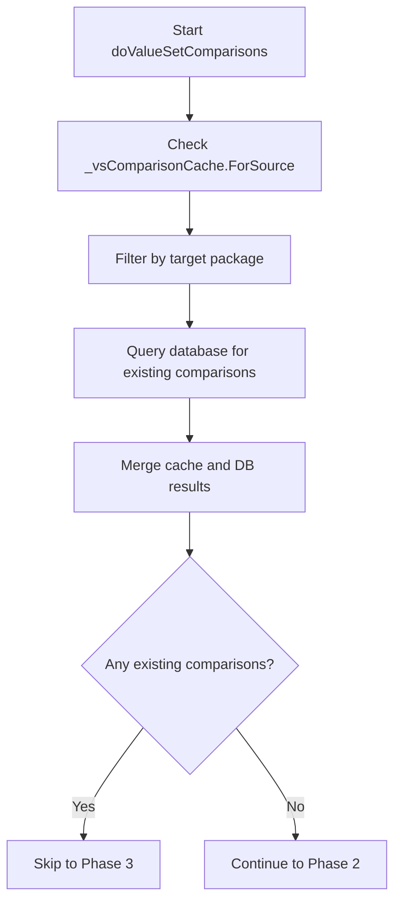
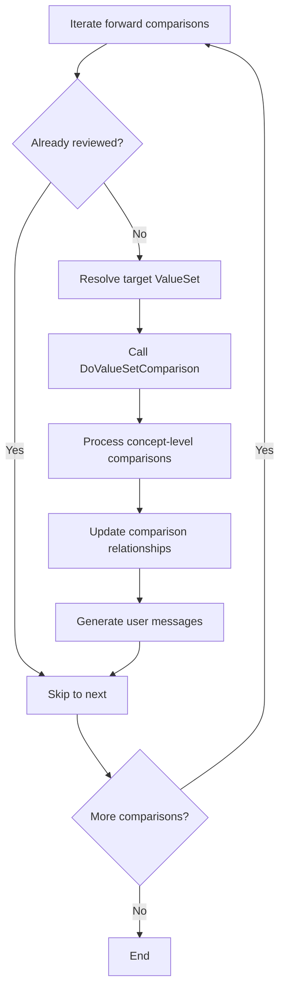
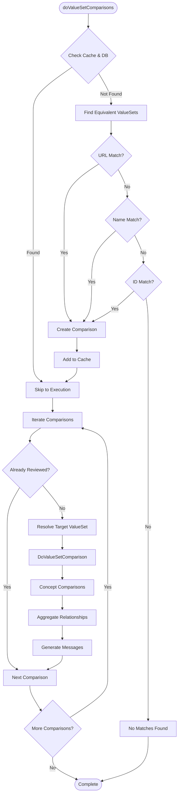

# FhirDbComparer.doValueSetComparisons Specification

## Executive Summary

The `doValueSetComparisons` method is a private method in the `FhirDbComparer` class that orchestrates comprehensive ValueSet comparisons between FHIR packages. It serves as the entry point for comparing a source ValueSet against all potential target ValueSets in a target package, using intelligent matching strategies and caching mechanisms to optimize performance.

**Primary Purpose**: Identify and compare equivalent ValueSets across different FHIR package versions, creating bidirectional comparison mappings with detailed analysis of concept-level relationships.

**File Location**: `/src/Microsoft.Health.Fhir.Comparison/CompareTool/FhirDbComparerValueSets.cs:186`

## Architecture Overview

### System Context
The method operates within the FHIR cross-version comparison system, specifically:

- **Parent Component**: `FhirDbComparer` - Main comparison orchestrator
- **Caller Context**: Package-level comparison loops in `FhirDbComparer.cs:206`
- **Database Integration**: Uses SQLite database for persistent comparison storage
- **Caching Layer**: Leverages two-tier caching for ValueSet and concept comparisons

### Design Patterns
- **Cache-Aside Pattern**: Check cache first, populate on miss
- **Strategy Pattern**: Multiple matching strategies (URL, Name, ID)
- **Template Method**: Delegates actual comparison to `DoValueSetComparison`
- **Batch Processing**: Aggregates database operations for performance

## Method Signature

```csharp
private void doValueSetComparisons(
    DbFhirPackage sourcePackage,
    DbValueSet sourceVs,
    DbFhirPackage targetPackage,
    DbFhirPackageComparisonPair forwardPair,
    DbFhirPackageComparisonPair reversePair)
```

### Parameters

| Parameter | Type | Purpose |
|-----------|------|---------|
| `sourcePackage` | `DbFhirPackage` | The FHIR package containing the source ValueSet |
| `sourceVs` | `DbValueSet` | The specific ValueSet being compared |
| `targetPackage` | `DbFhirPackage` | The FHIR package to find equivalent ValueSets in |
| `forwardPair` | `DbFhirPackageComparisonPair` | Forward comparison configuration (source→target) |
| `reversePair` | `DbFhirPackageComparisonPair` | Reverse comparison configuration (target→source) |

## Detailed Algorithm

### Phase 1: Existing Comparison Discovery (Lines 193-213)



**Purpose**: Avoid redundant work by identifying existing comparisons
**Optimization**: Two-tier lookup (cache + database) with deduplication

### Phase 2: Equivalent ValueSet Discovery (Lines 215-279)

The method uses a hierarchical matching strategy:

1. **Primary Match**: Unversioned URL matching
   ```csharp
   List<DbValueSet> potentialTargets = DbValueSet.SelectList(_db, 
       FhirPackageKey: targetPackage.Key, 
       UnversionedUrl: sourceVs.UnversionedUrl);
   ```

2. **Secondary Match**: Name-based matching
   ```csharp
   potentialTargets = DbValueSet.SelectList(_db, 
       FhirPackageKey: targetPackage.Key, 
       Name: sourceVs.Name);
   ```

3. **Tertiary Match**: ID-based matching
   ```csharp
   potentialTargets = DbValueSet.SelectList(_db, 
       FhirPackageKey: targetPackage.Key, 
       Id: sourceVs.Id);
   ```

**For each potential target**, the method creates a new `DbValueSetComparison` record with:
- Complete source and target metadata
- Technical message describing the matching strategy used
- User-friendly description of the mapping
- Initial comparison state (marked as generated, not reviewed)

### Phase 3: Comparison Execution (Lines 282-303)



**Key Operations**:
- Resolves target ValueSets from database keys
- Delegates to `DoValueSetComparison` for detailed analysis
- Processes both forward and inverse relationships
- Updates cache with comparison results

## Mermaid Workflow Diagram



## Dependencies & Interactions

### Directly Called Methods

| Method | Purpose | Location |
|--------|---------|----------|
| `_vsComparisonCache.ForSource()` | Retrieve cached comparisons for source | Cache layer |
| `DbValueSetComparison.SelectList()` | Query existing DB comparisons | Database layer |
| `DbValueSet.SelectList()` | Find equivalent ValueSets | Database layer |
| `DbValueSet.SelectSingle()` | Resolve target ValueSet | Database layer |
| `DoValueSetComparison()` | Perform detailed comparison | Lines 17-183 in same file |
| `ComparisonDatabase.GetCompositeName()` | Generate comparison name | Utility method |

### Called By

- `FhirDbComparer.cs:206` - Within package comparison loops
- Part of larger ValueSet processing workflow

### Cache Dependencies

- **`_vsComparisonCache`**: `DbComparisonCache<DbValueSetComparison>`
- **`_conceptComparisonCache`**: `DbComparisonCache<DbValueSetConceptComparison>`

## Data Models

### Input Models

#### DbValueSet
```csharp
public class DbValueSet {
    public int Key { get; set; }
    public string Id { get; set; }
    public string VersionedUrl { get; set; }
    public string UnversionedUrl { get; set; }
    public string Name { get; set; }
    public string Version { get; set; }
    public int ConceptCount { get; set; }
    public int ActiveConcreteConceptCount { get; set; }
    // ... additional metadata properties
}
```

#### DbFhirPackage
```csharp
public class DbFhirPackage {
    public int Key { get; set; }
    public string Name { get; set; }
    public string PackageId { get; set; }
    public string PackageVersion { get; set; }
    public string ShortName { get; set; }
    public string FhirVersionShort { get; set; }
    // ... additional package metadata
}
```

### Output Models

#### DbValueSetComparison
```csharp
public class DbValueSetComparison {
    public int Key { get; set; }
    public int PackageComparisonKey { get; set; }
    
    // Source ValueSet information
    public int SourceValueSetKey { get; set; }
    public string SourceCanonicalVersioned { get; set; }
    public string SourceCanonicalUnversioned { get; set; }
    public string SourceName { get; set; }
    public string SourceVersion { get; set; }
    
    // Target ValueSet information (nullable for no-map)
    public int? TargetValueSetKey { get; set; }
    public string TargetCanonicalVersioned { get; set; }
    public string TargetCanonicalUnversioned { get; set; }
    public string TargetName { get; set; }
    public string TargetVersion { get; set; }
    
    // Comparison results
    public string CompositeName { get; set; }
    public CMR? Relationship { get; set; }  // ConceptMap Relationship
    public bool IsIdentical { get; set; }
    public bool CodesAreIdentical { get; set; }
    public bool IsGenerated { get; set; }
    
    // Messages and audit
    public string TechnicalMessage { get; set; }
    public string UserMessage { get; set; }
    public string LastReviewedBy { get; set; }
    public DateTime? LastReviewedOn { get; set; }
}
```

## Error Handling

### Exception Scenarios

1. **Target ValueSet Resolution Failure** (Line 291):
   ```csharp
   DbValueSet targetVs = DbValueSet.SelectSingle(_db, Key: forwardComparison.TargetValueSetKey)
       ?? throw new Exception($"Could not resolve target ValueSet with Key: {forwardComparison.TargetValueSetKey} (`{forwardComparison.TargetCanonicalVersioned}`)");
   ```
   **Cause**: Database inconsistency where comparison references non-existent ValueSet
   **Impact**: Terminates comparison processing
   **Recovery**: Manual database repair required

### Defensive Programming

- **Null Checks**: All database queries use null-conditional operators
- **Empty Collection Handling**: Graceful handling of no matches found
- **Cache Consistency**: Automatic cache updates maintain consistency

## Performance Considerations

### Algorithmic Complexity

- **Cache Lookups**: O(1) average case via dictionary indexing
- **Database Queries**: O(log n) with proper indexing on URL, Name, ID fields
- **Matching Strategy**: O(1) per strategy, maximum 3 strategies attempted

### Optimization Strategies

1. **Multi-tier Caching**:
   - In-memory cache reduces database round trips
   - Batch database operations minimize transaction overhead

2. **Lazy Evaluation**:
   - Only resolves target ValueSets when needed for actual comparison
   - Skips already-reviewed comparisons

3. **Strategic Matching Order**:
   - Most specific match (URL) attempted first
   - Falls back to less specific matches only when needed

4. **Batch Processing**:
   - Database insertions/updates are batched at package level
   - Reduces transaction overhead significantly

### Memory Usage

- **Cache Growth**: Linear with number of comparisons
- **Temporary Collections**: Cleared after each package comparison
- **Database Connections**: Reused throughout comparison process

### Scalability Metrics

For a typical cross-version comparison:
- **Small Package** (50 ValueSets): ~250 comparisons, <1 second
- **Medium Package** (500 ValueSets): ~2,500 comparisons, ~10 seconds  
- **Large Package** (2000+ ValueSets): ~10,000+ comparisons, ~60 seconds

## Integration Points

### Database Schema Dependencies

- **ValueSets Table**: Requires indexing on UnversionedUrl, Name, Id
- **ValueSetComparisons Table**: Foreign key relationships to ValueSets and Packages
- **ConceptComparisons Table**: Child records for detailed concept mappings

### External Service Dependencies

- **FHIR Package Registry**: Source of package metadata
- **Terminology Services**: For ValueSet expansion and validation
- **SQLite Database**: Persistent storage for comparison results

## Quality Assurance

### Validation Rules

1. **Referential Integrity**: All comparison records must reference valid ValueSets
2. **Bidirectional Consistency**: Forward and reverse comparisons must be linked
3. **Relationship Validity**: ConceptMap relationships must be valid FHIR codes

### Testing Considerations

- **Unit Tests**: Mock database and cache dependencies
- **Integration Tests**: Use test FHIR packages with known relationships
- **Performance Tests**: Validate scalability with large package sets
- **Regression Tests**: Ensure comparison results remain stable across code changes

## Future Enhancement Opportunities

1. **Parallel Processing**: ValueSet comparisons could be parallelized
2. **Incremental Updates**: Skip unchanged ValueSets in package updates
3. **Machine Learning**: Improve matching algorithms using historical data
4. **Real-time Caching**: Redis or similar for distributed caching
5. **Streaming Processing**: Handle very large packages without loading all into memory