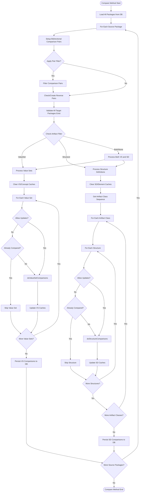

# FhirDbComparer.Compare Specification

## Executive Summary

The `FhirDbComparer.Compare` method is the central orchestrator for comparing FHIR packages and their contents across different versions or implementations. It performs comprehensive comparisons of Value Sets and Structure Definitions (including primitives, complex types, resources, profiles, and logical models) between source and target FHIR packages, maintaining bidirectional comparison relationships and storing results in a database for analysis.

## Architecture Overview

The FhirDbComparer uses a partial class architecture distributed across multiple files:

```
FhirDbComparer (Main Class)
├── FhirDbComparer.cs          - Main Compare method and orchestration
├── FhirDbComparerValueSets.cs - Value set comparison logic
├── FhirDbComparerStructures.cs - Structure definition comparison logic
├── FhirDbComparerElements.cs   - Element comparison logic
├── FhirDbComparerElementTypes.cs - Element type comparison logic
└── FhirDbComparerValueSetConcepts.cs - Value set concept comparison logic
```

The system integrates with a SQLite database through Entity Framework, using caching mechanisms to optimize batch operations and minimize database roundtrips.

## Detailed Algorithm

### Method Signature
```csharp
public void Compare(
    FhirArtifactClassEnum? artifactFilter = null,
    HashSet<int>? comparisonPairFilterSet = null,
    bool allowUpdates = true)
```

### Parameters
- **artifactFilter**: Optional filter to compare only specific artifact types (ValueSet, PrimitiveType, etc.)
- **comparisonPairFilterSet**: Optional set of comparison pair IDs to limit the scope
- **allowUpdates**: When false, skips already-compared items

### Algorithm Steps

1. **Load All Packages**
   - Retrieves all DbFhirPackage records from the database into a dictionary

2. **Iterate Through Source Packages**
   - For each package, processes it as a source for comparisons

3. **Setup Bidirectional Comparison Pairs**
   - For each source package's comparison pairs:
     - Applies comparisonPairFilterSet if provided
     - Finds or creates reverse comparison pairs
     - Ensures bidirectional relationships are properly linked
     - Validates all target packages exist

4. **Value Set Comparisons** (if artifactFilter permits)
   - Clears value set and concept comparison caches
   - For each value set in the source package:
     - Skips if allowUpdates=false and already compared
     - Calls doValueSetComparisons for each bidirectional pair
   - Persists cached comparisons to database

5. **Structure Definition Comparisons** (if artifactFilter permits)
   - Clears all structure-related caches
   - Processes structures in specific order:
     - PrimitiveType → ComplexType → Resource → Profile → LogicalModel
   - For each structure:
     - Skips if allowUpdates=false and already compared
     - Calls doStructureComparisons for each bidirectional pair
   - Persists cached comparisons to database

## Mermaid Workflow Diagram



## Dependencies & Interactions

### Called Methods
- **doValueSetComparisons** (FhirDbComparerValueSets.cs:186)
  - Performs actual value set comparison logic
  - Finds equivalent value sets by URL/name matching
  - Updates comparison caches

- **doStructureComparisons** (FhirDbComparerStructures.cs:309)
  - Performs structure definition comparison logic
  - Handles special cases for primitive type mappings
  - Triggers element-level comparisons

- **invert** (FhirDbComparer.cs:329)
  - Creates reverse comparison pairs
  - Inverts relationship directions

### Database Operations (via Entity Framework)
- DbFhirPackage.SelectDict()
- DbFhirPackageComparisonPair.SelectList()
- DbValueSet.SelectList()
- DbStructureDefinition.SelectList()
- DbValueSetComparison.SelectCount()
- DbStructureComparison.SelectCount()
- Insert/Update operations on comparison caches

### Cache Management
All caches implement DbComparisonCache<T> pattern:
- _vsComparisonCache
- _conceptComparisonCache
- _sdComparisonCache
- _edComparisonCache
- _collatedTypeComparisonCache
- _typeComparisonCache

## Data Models

### Input Models
- **DbFhirPackage**: Represents a FHIR package with version info
- **DbFhirPackageComparisonPair**: Defines comparison relationships between packages
- **DbValueSet**: Value set definitions within packages
- **DbStructureDefinition**: Structure definitions within packages

### Output Models
- **DbValueSetComparison**: Results of value set comparisons
- **DbValueSetConceptComparison**: Individual concept comparisons
- **DbStructureComparison**: Results of structure comparisons
- **DbElementComparison**: Element-level comparisons
- **DbElementTypeComparison**: Type-specific comparisons
- **DbCollatedTypeComparison**: Aggregated type comparisons

### Key Enumerations
- **FhirArtifactClassEnum**: Categories of FHIR artifacts
- **ConceptMapRelationship**: Relationship types between concepts/structures

## Error Handling

### Explicit Error Conditions
1. **Package Resolution Failure** (line 167-170)
   ```csharp
   if (bidirectionalPairs.Any(biPair => !packages.ContainsKey(biPair.forward.TargetPackageKey)))
       throw new Exception("Failed to resolve packages in all pairwise comparisons!");
   ```

### Implicit Error Handling
- Database operations rely on Entity Framework exception handling
- Null reference checks when finding reverse pairs
- Cache operations handle duplicates internally

## Performance Considerations

### Optimization Strategies
1. **Batch Processing**
   - All comparisons are cached before database writes
   - Bulk Insert/Update operations minimize roundtrips

2. **Selective Processing**
   - artifactFilter allows focused comparisons
   - comparisonPairFilterSet limits scope
   - allowUpdates=false skips reprocessing

3. **Memory Management**
   - Caches are cleared before each major processing phase
   - Structured iteration prevents loading all data at once

4. **Processing Order**
   - Artifact classes processed in dependency order:
     - PrimitiveType → ComplexType → Resource → Profile → LogicalModel
   - Ensures base types are compared before derived types

### Complexity Analysis
- **Time Complexity**: O(P × C × A)
  - P = number of packages
  - C = number of comparison pairs per package
  - A = number of artifacts per package
- **Space Complexity**: O(N) where N is the total number of comparisons cached

### Scalability Considerations
- Database indexing on foreign keys critical for performance
- Cache size grows with comparison count
- Bidirectional pair validation adds overhead but ensures consistency

## Usage Example

```csharp
// Compare only ValueSets between specific packages
var comparer = new FhirDbComparer(comparisonDb, loggerFactory);
var pairFilter = new HashSet<int> { 1, 2, 3 };
comparer.Compare(
    artifactFilter: FhirArtifactClassEnum.ValueSet,
    comparisonPairFilterSet: pairFilter,
    allowUpdates: false
);
```

## Future Considerations

1. **Parallelization Opportunities**
   - Package-level processing could be parallelized
   - Independent artifact types could be processed concurrently

2. **Incremental Updates**
   - Track modification timestamps for smarter updates
   - Implement differential comparisons

3. **Memory Optimization**
   - Implement cache size limits with LRU eviction
   - Stream large comparison results directly to database