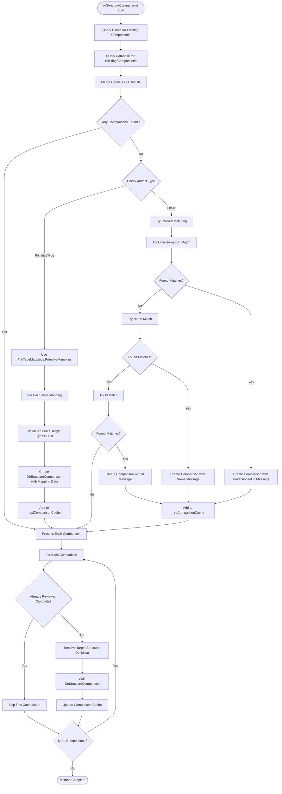

# FhirDbComparer.doStructureComparisons Specification

## Executive Summary

The `doStructureComparisons` method is a private orchestrator method within the `FhirDbComparer` class that manages the comparison of FHIR Structure Definitions between two packages. It discovers, creates, and processes structure comparisons by combining cached data, database queries, and specialized logic for different FHIR artifact types, particularly handling primitive type mappings through predefined relationships.

## Architecture Overview

This method operates as a high-level coordinator within the FHIR cross-version comparison system. It sits between the main comparison driver (`Compare` method) and the detailed comparison logic (`DoStructureComparison`), serving as the discovery and setup layer that:

1. **Discovers Existing Comparisons**: Checks both cache and database for existing structure comparisons
2. **Auto-Generates Missing Comparisons**: Creates comparisons for structures that haven't been compared yet
3. **Delegates Deep Analysis**: Calls `DoStructureComparison` for detailed element-level comparison
4. **Manages Bidirectional Relationships**: Ensures forward and reverse comparison pairs are properly linked

## Method Signature

```csharp
private void doStructureComparisons(
    DbFhirPackage sourcePackage,
    DbStructureDefinition sourceSd,
    DbFhirPackage targetPackage,
    DbFhirPackageComparisonPair forwardPair,
    DbFhirPackageComparisonPair reversePair)
```

### Parameters
- **`sourcePackage`**: Source FHIR package containing the structure to compare
- **`sourceSd`**: Source structure definition being compared
- **`targetPackage`**: Target FHIR package to compare against  
- **`forwardPair`**: Forward comparison pair (source → target)
- **`reversePair`**: Reverse comparison pair (target → source)

## Detailed Algorithm

### Phase 1: Comparison Discovery
1. **Cache Lookup**: Query `_sdComparisonCache.ForSource(sourceSd.Key)` for cached comparisons
2. **Database Query**: Execute `DbStructureComparison.SelectList()` for existing database comparisons
3. **Merge Results**: Combine cached and database results, avoiding duplicates

### Phase 2: Auto-Generation Logic
If no existing comparisons are found, the method attempts to create them using different strategies:

#### For Primitive Types (`FhirArtifactClassEnum.PrimitiveType`)
- **Mapping Source**: Uses `FhirTypeMappings.PrimitiveMappings` predefined relationships
- **Validation**: Ensures both source and target primitive types exist in their respective packages
- **Relationship Assignment**: Applies predefined relationships from type mappings
- **Generated Properties**: 
  - `IsGenerated = true`
  - `TechnicalMessage = tm.Comment` (from type mapping)
  - Relationship values from mapping structure

#### For Other Artifact Types
Uses a hierarchical matching strategy with progressively relaxed criteria:

1. **Primary Match**: `UnversionedUrl` comparison
   - Query: `DbStructureDefinition.SelectList(_db, FhirPackageKey: targetPackage.Key, UnversionedUrl: sourceSd.UnversionedUrl)`
   - Message: "Inferred comparison based on unversioned URL match"

2. **Secondary Match**: `Name` comparison  
   - Query: `DbStructureDefinition.SelectList(_db, FhirPackageKey: targetPackage.Key, Name: sourceSd.Name)`
   - Message: "Inferred comparison based on Name match"

3. **Tertiary Match**: `Id` comparison
   - Query: `DbStructureDefinition.SelectList(_db, FhirPackageKey: targetPackage.Key, Id: sourceSd.Id)`
   - Message: "Inferred comparison based on Id match"

### Phase 3: Deep Comparison Processing
For each discovered or created comparison:

1. **Review Status Check**: Skip if `LastReviewedOn != null` and `ReviewType == Complete`
2. **Target Resolution**: Resolve target structure definition using `DbStructureDefinition.SelectSingle()`
3. **Deep Analysis**: Call `DoStructureComparison()` with all necessary cache and package parameters
4. **Cache Management**: Update comparison cache with results

## Mermaid Workflow Diagram



## Dependencies & Interactions

### Core Dependencies

#### **Cache Operations**
- **`_sdComparisonCache.ForSource(sourceSd.Key)`** - FhirDbComparerStructures.cs:317
  - Retrieves cached structure comparisons filtered by source key
  - Returns `IEnumerable<DbStructureComparison>` with target package filtering applied
  - Cache type: `DbComparisonCache<DbStructureComparison>`

- **`_sdComparisonCache.CacheAdd(comparison)`** - FhirDbComparerStructures.cs:396, 465
  - Adds new comparisons to cache for database persistence
  - Updates internal key-based and pair-based dictionaries

#### **Database Operations**
- **`DbStructureComparison.SelectList(_db, ...)`** - FhirDbComparerStructures.cs:321
  - Parameters: PackageComparisonKey, SourceFhirPackageKey, TargetFhirPackageKey, SourceStructureKey
  - Returns existing database comparison records

- **`DbStructureDefinition.SelectSingle(_db, ...)`** - FhirDbComparerStructures.cs:352, 358, 483
  - Used for primitive type validation and target resolution
  - Parameters vary: Key, FhirPackageKey + Name combinations

- **`DbStructureDefinition.SelectList(_db, ...)`** - FhirDbComparerStructures.cs:407, 414, 422
  - Used for inferred matching by UnversionedUrl, Name, Id
  - Returns `List<DbStructureDefinition>` of potential matches

#### **Core Processing Method**
- **`DoStructureComparison(...)`** - FhirDbComparerStructures.cs:489
  - Parameters: Multiple cache objects, packages, structures, comparisons, pairs
  - Performs detailed element-level comparison analysis
  - Updates comparison relationships and generates user messages

### Supporting Systems

#### **Type Mapping Infrastructure**
- **`FhirTypeMappings.PrimitiveMappings`** - Static array of `CodeGenTypeMapping` structures
- **`ComparisonDatabase.GetCompositeName(...)`** - Generates standardized comparison names
- **`DbStructureComparison.GetIndex()`** - Generates unique keys for new comparisons

#### **Data Models**
- **`DbStructureComparison`**: Core comparison record with relationship, review, and identity data
- **`DbStructureDefinition`**: FHIR structure metadata including artifact class classification
- **`DbFhirPackage`**: Package metadata for source/target identification
- **`FhirArtifactClassEnum`**: Categorizes FHIR artifacts (PrimitiveType, ComplexType, Resource, etc.)

## Data Models

### Input Structures
```csharp
// Source package and structure being compared
DbFhirPackage sourcePackage { Key, ShortName, ... }
DbStructureDefinition sourceSd { 
    Key, Name, Id, UnversionedUrl, VersionedUrl, 
    Version, ArtifactClass, ...
}

// Target package for comparison
DbFhirPackage targetPackage { Key, ShortName, ... }

// Bidirectional comparison pairs
DbFhirPackageComparisonPair forwardPair { Key, SourcePackageKey, TargetPackageKey, ... }
DbFhirPackageComparisonPair reversePair { Key, SourcePackageKey, TargetPackageKey, ... }
```

### Generated Structures
```csharp
// Created comparison records
DbStructureComparison {
    Key,                              // Generated index
    PackageComparisonKey,             // From forwardPair.Key
    SourceFhirPackageKey,             // From sourcePackage.Key
    TargetFhirPackageKey,             // From targetPackage.Key
    SourceStructureKey,               // From sourceSd.Key
    TargetStructureKey,               // From matched target structure
    SourceCanonicalVersioned,         // From sourceSd.VersionedUrl
    TargetCanonicalVersioned,         // From target structure
    SourceName, TargetName,           // Structure names
    CompositeName,                    // Generated composite identifier
    Relationship,                     // From mappings or null
    ConceptDomainRelationship,        // From mappings or null
    ValueDomainRelationship,          // From mappings or null
    IsGenerated = true,               // Always true for auto-generated
    TechnicalMessage,                 // Mapping comment or inference message
    UserMessage = null,               // Set later by DoStructureComparison
    IsIdentical = null,               // Determined by element comparison
}
```

### Type Mapping Structure
```csharp
// Primitive type mappings from FhirTypeMappings.PrimitiveMappings
readonly record struct CodeGenTypeMapping(
    string SourceType,                // Source primitive type name
    string TargetType,                // Target primitive type name  
    CMR Relationship,                 // ConceptMapRelationship enum
    CMR ConceptDomainRelationship,    // Domain-level relationship
    CMR ValueDomainRelationship,      // Value-level relationship
    string Comment                    // Technical description
)
```

## Error Handling

### Database Resolution Failures
```csharp
// Target structure resolution - FhirDbComparerStructures.cs:483-486
DbStructureDefinition targetSd = DbStructureDefinition.SelectSingle(_db, Key: forwardComparison.TargetStructureKey)
    ?? throw new Exception($"Could not resolve target Structure with Key: {forwardComparison.TargetStructureKey} (`{forwardComparison.TargetCanonicalVersioned}`)");
```

### Error Categories
1. **Missing Target Structures**: Exception thrown if target structure cannot be resolved by key
2. **Database Connection Issues**: Underlying database operations may fail with connection errors
3. **Cache Corruption**: Invalid cache state could cause lookup failures
4. **Mapping Validation**: Primitive type mappings may reference non-existent structures

### Resilience Patterns
- **Graceful Degradation**: If inferred matching finds no targets, processing continues without creating comparisons
- **Defensive Null Checking**: Extensive null checking for database query results
- **Transaction Support**: Database operations designed for rollback capability
- **Skip-on-Error**: Individual comparison failures don't halt overall processing

## Performance Considerations

### Computational Complexity
- **Cache Lookups**: O(1) dictionary-based operations for existing comparisons
- **Database Queries**: O(log n) for indexed database lookups  
- **Inferred Matching**: O(n) linear scan through potential targets (typically small datasets)
- **Overall**: O(n * m) where n = source structures, m = target packages

### Optimization Strategies
1. **Cache-First Design**: Prioritizes cached data over database queries
2. **Batch Processing**: Accumulates changes for bulk database operations
3. **Early Termination**: Skips already-reviewed complete comparisons
4. **Indexed Queries**: Uses database indexes for efficient structure lookups

### Memory Usage
- **Cache Overhead**: Maintains in-memory dictionaries for comparison caching
- **Lazy Loading**: Database structures loaded on-demand during processing
- **Batch Accumulation**: Temporarily stores changes before database persistence

### Scaling Factors
- **Package Size**: Larger FHIR packages increase processing time linearly
- **Cache Hit Rate**: Higher cache hit rates significantly improve performance
- **Database Performance**: Query performance directly impacts overall speed
- **Type Mapping Size**: Primitive mapping lookup is constant-time regardless of mapping table size

## Usage Examples

### Basic Structure Comparison Setup
```csharp
// Called from main Compare method - FhirDbComparer.cs:265
foreach ((DbFhirPackageComparisonPair forward, DbFhirPackageComparisonPair reverse) in bidirectionalPairs)
{
    DbFhirPackage targetPackage = packages[forward.TargetPackageKey];
    doStructureComparisons(
        sourcePackage,      // Source FHIR package
        sourceSd,          // Source structure definition
        targetPackage,     // Target FHIR package  
        forward,           // Forward comparison pair
        reverse);          // Reverse comparison pair
}
```

### Primitive Type Mapping Example
```csharp
// For sourceSd with ArtifactClass = FhirArtifactClassEnum.PrimitiveType
// Method automatically creates comparisons using predefined mappings:

FhirTypeMappings.CodeGenTypeMapping example = new(
    SourceType: "string",
    TargetType: "string", 
    Relationship: CMR.Equivalent,
    ConceptDomainRelationship: CMR.Equivalent,
    ValueDomainRelationship: CMR.Equivalent,
    Comment: "Primitive type string maps directly between versions"
);
```

### Inferred Matching Flow
```csharp
// For non-primitive types, tries progressive matching:
// 1. UnversionedUrl: "http://hl7.org/fhir/StructureDefinition/Patient"
// 2. Name: "Patient"  
// 3. Id: "Patient"

List<DbStructureDefinition> potentialTargets = DbStructureDefinition.SelectList(
    _db, 
    FhirPackageKey: targetPackage.Key, 
    UnversionedUrl: sourceSd.UnversionedUrl);
```

## Integration Notes

### Caller Context
- **Primary Caller**: `FhirDbComparer.Compare()` method during structure definition processing
- **Execution Order**: Called after value set comparisons, before database persistence  
- **Iteration Context**: Called once per source structure per target package pair

### Cache Coordination
- **Shared Caches**: Operates on class-level caches (`_sdComparisonCache`, `_edComparisonCache`)
- **Persistence Strategy**: Changes accumulated in cache, persisted in batches by caller
- **Thread Safety**: Not thread-safe; designed for single-threaded execution

### Database Transaction Scope
- **No Direct Commits**: Method only updates caches; caller handles database persistence
- **Atomic Operations**: Individual database queries are atomic but overall operation is not
- **Rollback Support**: Cache-based design supports transaction rollback at caller level