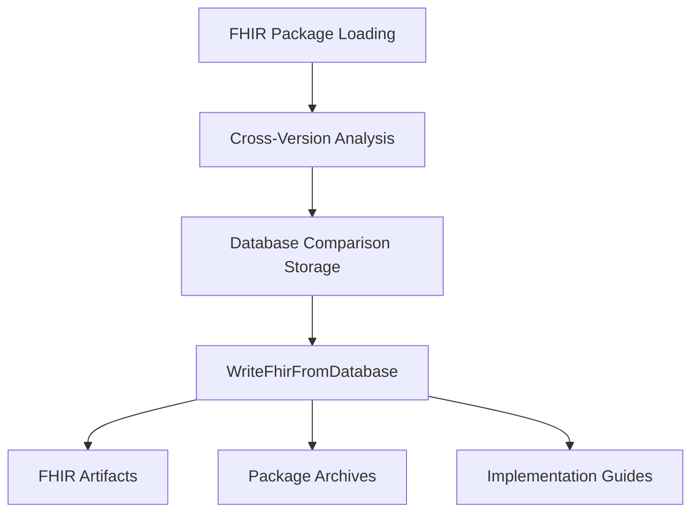
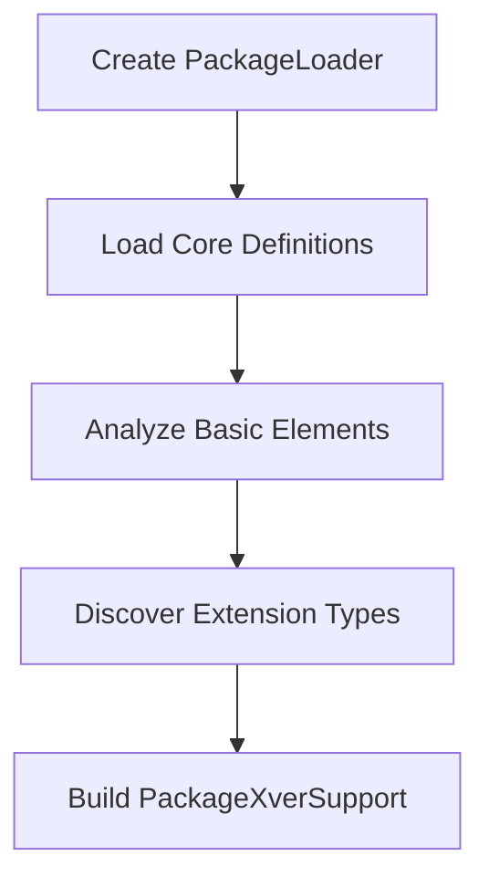
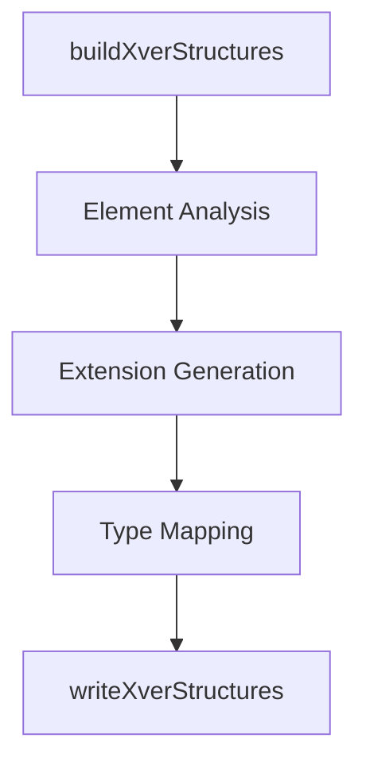

# XVerProcessor.WriteFhirFromDatabase Specification

## Executive Summary

The `WriteFhirFromDatabase` method is the primary output generator for the FHIR cross-version (XVer) processing system. It transforms database comparison analysis into deployable FHIR artifacts including extensions, value sets, structure definitions, and implementation guides that enable interoperability between different FHIR versions.

**Location**: `src/Microsoft.Health.Fhir.Comparison/XVer/XVerProcessorDbFhir.cs:98`  
**Class**: `XVerProcessor` (partial class)  
**Complexity**: High - 309 lines with extensive cross-version processing logic

## Architecture Overview

### System Position


### Core Dependencies
- **Database Layer**: `ComparisonDatabase` with SQLite backend
- **Configuration**: `ConfigXVer` for paths and versioning
- **FHIR Libraries**: Hl7.Fhir.Model, Hl7.Fhir.Serialization
- **Package System**: `PackageLoader` and `DefinitionCollection`
- **Graph Analysis**: `DbGraphSd` and `DbGraphVs` projection systems

## Method Signature

```csharp
public void WriteFhirFromDatabase(string? version = null, string? outputDir = null)
```

### Parameters
- **version** (optional): Artifact version override (defaults to `_config.XverArtifactVersion`)
- **outputDir** (optional): Output directory override (defaults to `_config.CrossVersionMapSourcePath`)

### Exceptions
- **Exception**: "Cannot generate FHIR artifacts without a loaded database!" if `_db == null`
- **Exception**: "Cannot write FHIR artifacts without output or map source folder!" if no output directory

## Detailed Algorithm

### Phase 1: Initialization (Lines 100-136)


**Key Operations:**
1. **Database Validation**: Ensures comparison database is loaded
2. **Directory Management**: Creates/cleans `{outputDir}/fhir/` directory
3. **Version Configuration**: Sets `_crossDefinitionVersion` for artifact metadata
4. **Package Discovery**: Loads `DbFhirPackage` list and comparison pairs

### Phase 2: Package Support Infrastructure (Lines 137-236)


**PackageXverSupport Creation Process:**
- **Core Loading**: Creates `DefinitionCollection` for each FHIR version
- **Basic Analysis**: Extracts element paths from Basic resource (lines 175-201)
- **Extension Discovery**: Identifies allowed types from Extension.value[x] (lines 203-235)
- **Snapshot Preparation**: Creates `SnapshotGenerator` for target version compatibility

### Phase 3: Cross-Version Artifact Generation (Lines 238-267)
For each source package in the collection:

#### 3A: Value Set Processing


**Algorithm (`buildXverValueSets`):**
1. **Graph Construction**: Creates `DbGraphVs` for concept projections
2. **Equivalence Analysis**: Identifies concepts lacking equivalent mappings
3. **ValueSet Creation**: Generates cross-version value sets with compose/expansion
4. **Recursive Processing**: Handles bidirectional version mapping

#### 3B: Structure Definition Processing  


**Extension Creation Logic (`createExtensionSd`):**
- **Context Discovery**: Determines valid application contexts using graph analysis
- **Element Mapping**: Maps unmapped elements to extensions
- **Type Compatibility**: Handles type substitutions and constraints
- **Complex Extensions**: Creates nested extensions for structured data

### Phase 4: Package Assembly (Lines 269-307)


**Package Types Generated:**
- **Single Version**: `hl7.fhir.uv.xver.{version}.{ver}.tgz`
- **Cross Version**: `hl7.fhir.uv.xver-{source}.{target}.{ver}.tgz`

## Data Models and Structures

### Core Database Models
```csharp
class DbFhirPackage {
    string PackageId;        // e.g., "hl7.fhir.r4.core"
    string PackageVersion;   // e.g., "4.0.1"
    string ShortName;        // e.g., "R4"
    string FhirVersionShort; // e.g., "4.0"
}

class XverPackageIndexInfo {
    PackageXverSupport SourcePackageSupport;
    PackageXverSupport TargetPackageSupport;
    List<string> IndexStructureJsons;
    List<string> IndexValueSetJsons;
    List<ImplementationGuide.ResourceComponent> IgStructures;
}

class PackageXverSupport {
    DbFhirPackage Package;
    HashSet<string> BasicElements;          // Basic resource element paths
    HashSet<string> AllowedExtensionTypes;  // Extension.value[x] types
    DefinitionCollection CoreDC;
    SnapshotGenerator SnapshotGenerator;
}
```

### Graph Projection System
```csharp
class DbGraphSd {
    // Provides element-level mappings across FHIR versions
    List<DbSdRow> Projection;  // Structure rows across versions
    class DbElementRow {
        DbElementCell?[] cells;  // One per package version
    }
}

class DbGraphVs {
    // Provides concept-level mappings across FHIR versions  
    List<DbVsRow> Projection;  // ValueSet rows across versions
    class DbVsConceptRow {
        DbVsConceptCell?[] cells;  // One per package version
    }
}
```

## Cross-Version Mapping Outcomes

The system tracks six distinct mapping strategies via `XverOutcome`:

| Outcome Code | Description | Usage |
|--------------|-------------|-------|
| `UseElementSameName` | Direct equivalent mapping | Element exists with same name/path |
| `UseElementRenamed` | Renamed equivalent mapping | Element equivalent but different name |
| `UseExtension` | Custom extension required | No equivalent mapping exists |
| `UseExtensionFromAncestor` | Inherited extension | Parent element already mapped |
| `UseBasicElement` | Basic resource mapping | Element maps to Basic resource |
| `UseOneOfElements` | Multiple mapping options | Several possible equivalent elements |

## Output Directory Structure

```
{outputDir}/fhir/
├── R4/                                    # Single version packages
│   └── package/
│       ├── package.json
│       ├── ImplementationGuide-xver-r4.json
│       ├── StructureDefinition-*.json
│       └── ValueSet-*.json
├── R4-for-R5/                            # Cross-version packages  
│   └── package/
│       ├── package.json
│       ├── StructureDefinition-ext-R4-*.json
│       └── ValueSet-R4-*-for-R5.json
├── R5-for-R4/                            # Reverse direction
│   └── package/
│       └── ...
├── hl7.fhir.uv.xver.r4.0.7.0.tgz        # Compressed validation packages
├── hl7.fhir.uv.xver.r5.0.7.0.tgz
├── hl7.fhir.uv.xver-r4.r5.0.7.0.tgz     # Cross-version packages
└── hl7.fhir.uv.xver-r5.r4.0.7.0.tgz
```

## Performance Considerations

### Computational Complexity
- **Package Processing**: O(n) where n = number of packages
- **Element Analysis**: O(m × p) where m = elements, p = packages  
- **Graph Projection**: O(e × v²) where e = elements, v = versions
- **Extension Generation**: O(unmapped_elements × target_versions)

### Memory Usage
- **Database Projections**: Held in memory during processing
- **Package Definitions**: Multiple `DefinitionCollection` instances
- **Generated Artifacts**: JSON serialization in memory before disk write

### Optimization Notes
- **Graph Caching**: Element projections built once per structure
- **Type Analysis**: Extension types resolved once per package
- **Parallel Opportunities**: Package processing could be parallelized
- **Current Limitation**: Single-threaded processing (line 252 logger indicates sequential)

## Error Handling and Edge Cases

### Known Limitations
- **Package Restrictions**: Skips R2/R3 for TGZ generation (lines 279-283)
- **Snapshot Generation**: Wrapped in try-catch, failures ignored (line 381)
- **Type Fallbacks**: Uses `FhirTypeMappings.PrimitiveTypeFallbacks` for unmappable types

### Validation Requirements
- Database must contain comparison results
- Package definitions must be loadable
- Basic resource structure must exist for element path analysis
- Extension structure must exist for type constraint discovery

## Integration Points

### CLI Integration
Called from `XVerProcessor.RunCommand()` for "fhir" command:
```csharp
case "fhir":
    LoadDatabase(false, false);
    WriteFhirFromDatabase();
    break;
```

### Web UI Integration  
Exposed via `IXverService.WriteFhirFromDatabase()`:
```csharp
public async Task WriteFhirFromDatabase(string? outputDirectory, string? version)
{
    XVerProcessor xverProcessor = new(_db, outputDirectory, _config.LogFactory);
    await Task.Run(() => xverProcessor.WriteFhirFromDatabase(outputDir: outputDirectory, version: version));
}
```

### Package Ecosystem
Generated packages integrate with:
- **FHIR Validator**: Via validation packages
- **Implementation Guides**: Through IG generation
- **Package Managers**: Via NPM-compatible package.json files

## Security and Safety Considerations

### Input Validation
- Database injection protection through parameterized queries
- Path traversal protection via `Path.Combine()` usage
- Directory cleanup with controlled deletion (lines 115-118)

### Output Safety  
- Controlled file system access within output directory
- JSON serialization through FHIR libraries (prevents injection)
- Archive creation with tar validation

This specification documents a sophisticated cross-version FHIR processing system that enables practical interoperability between FHIR versions through automatically generated extensions and supporting artifacts.