# FHIR Package Resolution

## General Notes

Finding FHIR packages is unfortunately complex.  Below is the resolution process based on some set of input.  The first section includes parsing a "directive" (e.g., `hl7.fhir.uv.ig.r4#1.0.0` input from a user) into components that affect how resolution is performed.

Note that there are a few *sources* for packages:
* FHIR NPM Registry: `packages.fhir.org`, a.k.a. `packages.simplifier.net`
    * Primary registry
    * Managed by Firely
* FHIR NPM Registry: `packages2.fhir.org`
    * Seconary registry
    * Managed by HL7 / Grahame
* HL7 Website: `hl7.org/fhir`
    * New FHIR core packages are always published here *first*
    * Links found on [FHIR Publication History](http://hl7.org/fhir/directory.html)
* CI Website: `build.fhir.org`
    * CI site for HL7-published packages - FHIR Core and IGs
    * Since the site defaults to core but is FHIR-version dependent, core package resolution is:
        * Default branch: `/hl7.fhir.r{FHIR release number}.{package-type}.tgz` (details in [Published Core Package Names](#publishedCorePackageNames))
        * Other branches: `/branches/{branch-name}/hl7.fhir.r{FHIR release number}.{package-type}.tgz`
    * URL strucutre for finding IG packages is not based on package name:
        * Default branch: `/ig/{org}/{repo}/package.tgz`, based on  GitHub organization and repository name of the package source
        * Other branches: `/ig/{org}/{repo}/branches/{branch}/package.tgz`, based on  GitHub organization, repository, and branch of the package source
    * Use [qas.json](https://build.fhir.org/ig/qas.json) to map packages to CI URLs
        * Parsing directives for CI builds is currently unreliable
        * Issue is that the local cache does not include the GH org, so we cannot reliably roundtrip a package and a branch.
        * Using full URL is safe to pull, but can still lead to cache conflicts if there are two matching branch names (e.g., a fork)
* External registries
    * May include additional external registries not listed here.
    * May be public or private.

Note that the secondary registry (`packages2.fhir.org`) includes experimental and development features and information not available in the primary registry.  In this document, all processes assume use of the published APIs and models, but make note of the differences.


### External Links

* [Confluence: FHIR Package Cache](https://confluence.hl7.org/display/FHIR/FHIR+Package+Cache)
* [Confluence: FHIR NPM Package Specification](https://confluence.hl7.org/display/FHIR/NPM+Package+Specification)
* [Confluence: FHIR Package Registry User Documentation](https://confluence.hl7.org/display/FHIR/FHIR+Package+Registry+User+Documentation)
* [FHIR Spec: FHIR Releases and Versioning](https://hl7.org/fhir/versions.html#versions)
* [FHIR Indexing: fhir-ig-list.json](https://github.com/FHIR/ig-registry/blob/master/fhir-ig-list.json)
* [Firely Package Server API Documentation](https://docs.fire.ly/projects/Simplifier/features/api.html#package-server-api)
    * [SwaggerHub: Simplifier.net FHIR Package API](https://app.swaggerhub.com/apis-docs/firely/Simplifier.net_FHIR_Package_API/1.0.1#/)

## Overview

When resolving a package there are only a few steps:

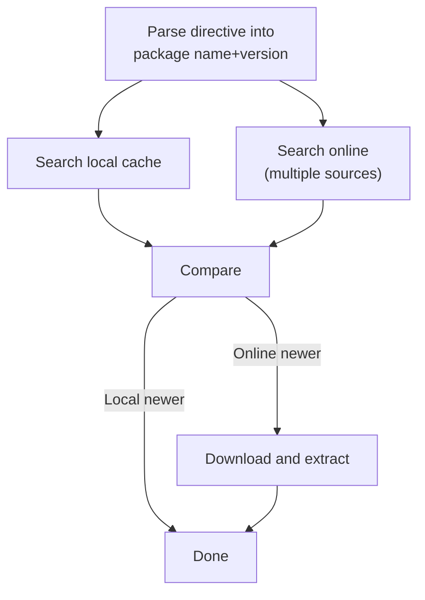

* Resolve input (directive) into a concrete name and version/alias pair, by splitting the directive on `#`. The part before `#` is a name, and the part after `#` is a version.
    * For published packages, the version component is a literal (e.g., 4.0.1, 1.0.0-ballot).
    * In some cases, the directive uses a version alias, which must be resolved into an exact version. Aliases like these never appear in a local cache:
        * `latest`: use the package tagged as `latest` in the registry.  Note that there can be issues with discrepancies between different registries.
        * `4.0.x`: use the package with the highest patch number matching the major and build version.
    * Other aliases are durable symbols that can appear in the cache and have their contents updated:
> [name=Josh Mandel] I think you cover these in detail below -- do you want them here too, or just note "Other aliases such as `current` can appear.... see below"?
        * `current`: the current CI build, loaded from the default branch
        * `current${branch name}`: the current CI build, loaded from the named branch
        * `dev`: refers to a *local* build if one exists in the local cache, otherwise fall-back to `current`
            * Q: what is the currency-resolution? E.g., a local build from today vs. CI build from today.. or local build from a year ago vs. CI build from today.
* Compare the local cache against what was resolved online.
  > [name=Josh Mandel]This "Compare the local cache..." section only applies for aliases, right? Can it be nested there, or can this be mentioned?
  > [name=Gino Canessa]It applies to anything without a fully-qualified version.  E.g., if you have 4.0.x, we need to compare what we find in the local cache against the online version list.  Needs more clarification.
    * If a specific version was resolved, the contents are assumed to match.
    * For CI builds, build date comparison is required.
* If necessary, download and extract the package into the cache.
* Note that it is often desireable to process package dependencies.  Package dependencies are listed with a combination of name and version, so it is simply a matter of traversing them with the same process.

## Parsing Directives

* The term `directive` is used here to qualify a package name and version/alias
* This document assumes user input in the style of the directives as they appear in the cache.
    * Note that for CI builds, directives are not deterministic.  The package directives for CI builds (at most) track the branch name.  This means that forks of a package will overwrite each other.  
    * When using CI builds, it is recommended to use either the full URL as input or a combination of GitHub Organzation and Repo to build the directive.
    * Resolution in those cases simply starts from the corresponding resolution step and continues from there (e.g., checking build date against local cache and downloading or not as appropriate).

### <a id="packageNaming"></a>Package Naming

There are three categories of name types I have seen used in directives:
* **IG with suffix**: Full IG package name with a FHIR-version suffix.
    * E.g., `hl7.fhir.uv.ig.r4`
    * Packages automatically built by publication tooling when multiple FHIR versions are supported by the same IG.
    * Can be listed in the cache.
    * FHIR Core packages *do not* allow this syntax (only IGs).
* **IG without suffix**: Full IG package name without a FHIR-version suffix.
    * E.g., `hl7.fhir.uv.ig`
    * Packages built for a single FHIR version without cross-FHIR-version tooling.
    * Placeholder (or 'default') packages built by publication tooling when FHIR-version specific packages are generated.
    * Can be listed in the cache.
* **Core: full**: FHIR Core package full name.
    * E.g., `hl7.fhir.r4.core`
    * Can be listed in the cache.
* **Core: partial**: Partial package name - only allowed for FHIR Core packages.
    * E.g., `hl7.fhir.r4`
    * Seen as input from users to refer to core FHIR-version packages.
    * Typically *means* some combination of packages with `core` and `expansion` suffixes; sometimes assumes `examples` as well.
    * Cannot be listed in the cache - must be resolved to actual packages before downloading.

Note that CI Build resolution requires looking up records in the `qas.json` file since package names need to be mapped to GitHub organizations and repositories.  Details can be found in [Resolving CI IG Packages](#resolveCiIg) and [Resolving CI Core Packages](#resolveCiCore).

### <a id="packageVersioning"></a>Package Versioning

* Packages published by HL7 follow the version conventions documented in [FHIR Releases and Versioning](https://hl7.org/fhir/versions.html#versions).
* External packages are *recommended* to follow the same convention (or [Semantic Versioning](https://semver.org/)).

There are a few types of version labels allowed:
* **exact versions**: A fully-qualified version, e.g., `4.0.1`
* **partial versions**: A version with the last component not defined (in HL7 - the patch version), e.g., `4.0.x`, `4.0`.
    * Note that 'shortened' versions such as `4.0` are not legal in tooling but are used to represent FHIR version in (for example) MIME types.
    * Listed here so that it can be considered during input processing to reduce user-facing errors, since it is mappable to the `.x` format.
* `latest`: The most recent published version, as labeled in a registry with the `latest` distribution tag.
    * Note that discrepancies between registries here can be complicated to resolve.
* `dev`: The most recent *local* build if one exists, otherwise fall-back to `current`
* `current`: The current CI build, loaded from the default branch
* `current${branch name}`: The current CI build, loaded from the named branch. For example, `current$wip` would refer to a `wip` branch in GitHub.


### Table 1 - Directives and Descriptions

| Directive                    | Name                | Name Type         | Version          | Version Type                  |
| ---------------------------- | ------------------- | ----------------- | ---------------- | ----------------------------- |
| `hl7.fhir.uv.ig.r4#1.0.0`    | `hl7.fhir.uv.ig.r4` | IG with suffix    | `1.0.0`          | exact                         |
| `hl7.fhir.uv.ig#1.0.0`       | `hl7.fhir.uv.ig`    | IG without suffix | `1.0.0`          | exact                         |
| `hl7.fhir.r4.core#4.0.1`     | `hl7.fhir.r4.core`  | Core full         | `4.0.1`          | exact                         |
| `hl7.fhir.r4#4.0.1`          | `hl7.fhir.r4`       | Core partial      | `4.0.1`          | exact                         |
| `hl7.fhir.r4.core#4.0.x`     | `hl7.fhir.r4.core`  | Core full         | `4.0.x`          | partial                       |
| `hl7.fhir.r4#4.0.x`          | `hl7.fhir.r4`       | Core partial      | `4.0.x`          | partial                       |
| `hl7.fhir.uv.ig#latest`      | `hl7.fhir.uv.ig`    | IG without suffix | `latest`         | latest release                |
| `hl7.fhir.uv.ig#dev`         | `hl7.fhir.uv.ig`    | IG without suffix | `dev`            | local or CI build             |
| `hl7.fhir.uv.ig#current`     | `hl7.fhir.uv.ig`    | IG without suffix | `current`        | CI build                      |
| `hl7.fhir.r4#current$branch` | `hl7.fhir.r4`       | Core partial      | `current$branch` | CI build from branch `branch` |

### Table 2 - IG Package Name and Version/Alias Combinations

|                        | IG with FHIR suffix                | IG without FHIR suffix          |
| ---------------------- | ---------------------------------- | ------------------------------- |
| **Exact version**      | `hl7.fhir.uv.ig.r4#1.0.0`          | `hl7.fhir.uv.ig#1.0.0`          |
| **Partial Version**    | `hl7.fhir.uv.ig.r4#1.0.x`          | `hl7.fhir.uv.ig#1.0.x`          |
| **Latest**             | `hl7.fhir.uv.ig.r4#latest`         | `hl7.fhir.uv.ig#latest`         |
| **Local build**        | `hl7.fhir.uv.ig.r4#dev`            | `hl7.fhir.uv.ig#dev`            |
| **CI Build (default)** | `hl7.fhir.uv.ig.r4#current`        | `hl7.fhir.uv.ig#current`        |
| **CI Build (branch)**  | `hl7.fhir.uv.ig.r4#current$branch` | `hl7.fhir.uv.ig#current$branch` |

### Table 3 - FHIR Core Name and Version/Alias Combinations

|                        | FHIR Core Full                    | FHIR Core Partial            |
| ---------------------- | --------------------------------- | ---------------------------- |
| **Exact version**      | `hl7.fhir.r4.core#4.0.1`          | `hl7.fhir.r4#4.0.1`          |
| **Partial Version**    | `hl7.fhir.r4.core#4.0.x`          | `hl7.fhir.r4#4.0.x`          |
| **Latest**             | `hl7.fhir.r4.core#latest`         | `hl7.fhir.r4#latest`         |
| **Local build**        | `hl7.fhir.r4.core#dev`            | `hl7.fhir.r4#dev`            |
| **CI Build (default)** | `hl7.fhir.r4.core#current`        | `hl7.fhir.r4#current`        |
| **CI Build (branch)**  | `hl7.fhir.r4.core#current$branch` | `hl7.fhir.r4#current$branch` |


## Resolving directives to packages

Based on the three types of directives, we *may* need to resolve a few things.  The general processes we use to resolve packages has two major sets of combinations: IG vs. Core packages and published vs. CI build.  For clarity, I am splitting out each of the four possible paths.

Determining which of the four processes we want is fairly straightforward.  Using the package name, we can determine whether something is a core package or an IG.  The version directive can be used to determine whether we are using a published or CI version.

### Mapping names to package types

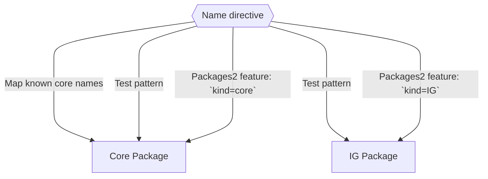

Starting with a name directive, we have a few choices to determine our path:
* Software can track all known 'published' core package literals.  The list is published on the [FHIR Directory](http://hl7.org/fhir/directory.html) page.  If the software is tracking these package names, it is simply a lookup to determine if the literal is a core package or IG package.
* The core package pattern is `hl7.fhir.r{version}.{package-type}`, which are period (dot) separated segments:
    * Segment 1: `hl7` - literal
    * Segment 2: `fhir` - literal
    * Segment 3: `r{version}` - the `r` character literal followed by the release sequence, i.e., `r2`, `r3`, `r4`, `r4b`, `r5`, `r6`
    * Segment 4: `{package-type}` - each release contains a variety of published packages.  All releases contain `core` (definitions) and `expansions` (required ValueSet expansions).  More information can be found in [Published Core Package Names](#publishedCorePackageNames).
    * Note that for *input* sometimes you will see `hl7.fhir.r{version}` without the `{package-type}` segment.  In this case, the directive needs to be expanded to a set of packages depending on context, typically by adding `core` and `expansions`.
* The IG package pattern is `hl7.fhir.{realm}.{name}`, which are period (dot) separated segments:
    * Segment 1: `hl7` - literal
    * Segment 2: `fhir` - literal
    * Segment 3: `{realm}` - jursdictional realm where this package applies. `uv` is for Universal Realm, `au` for Australia, `us` for United States, etc.
        * Q: Is there a list of realms anywhere?  Could not find.
    * Segment 4: `{name}` - actual package name, such as `subscriptions-backport`, `ips`, `genomics-reporting`, etc.
* For comparison, the two patterns for HL7-published FHIR packages are:

|           | Core Package        | IG Package               |
| --------- | ------------------- | ------------------------ |
| Segment 1 | `hl7` (literal)     | `hl7` (literal)          |
| Segment 2 | `fhir` (literal)    | `fhir` (literal)         |
| Segment 3 | FHIR Version (`r#`) | Realm (`uv`, `us`, etc.) |
| Segment 4 | Package-contents    | Name                     |

* Note that none of these rules apply for non-HL7-published packages.  However, any package not published by HL7 *cannot* be a Core package (by definition).  Therefore, any package that does not match either pattern is also an IG package.
* Currently, the `packages2.fhir.org` registry includes a `kind` element in listings.  If the package you are resolving is present there (with any version), the kind literals can be used to distinguish package types.  See [Current Secondary Registry Catalog Record (Experimental)](#jsonRegistryCatalog2) and [Current Secondary Registry Package Information (Experimental)](#jsonRegistryPackage2) for details.

### Mapping version directives to resolution types

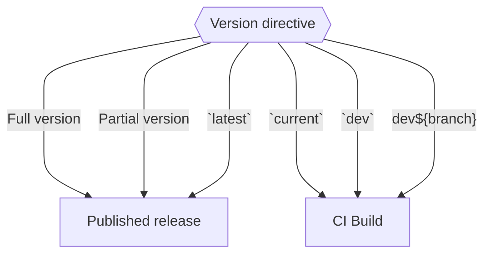

Starting with a version directive, the simplest route is to filter for known aliases and go from there.  More detail on the aliases can be found in [Package Versioning](#packageVersioning).
* `current`, `dev`, and `dev${branch-name}` all resolve to the CI Build path.
* All other values attempt to resolve via the published package path.
    * Note that while HL7 packages use a variant SemVer, there is no version-format requirement for external IGs.  Version literals can be *any* valid string, e.g., `20231006`, `89b1ea93cb175cbc32c291043224be8d6af9d640`, `version-1-final`, etc..


### Resolving Published IG Packages

#### Package Names

Generally, resolving package names of published IG packages is straightfoward - the specified package exists or it does not.  There is, unfortunately, one exception around the existence of FHIR-version-specific packages.  These packages are 'behind' a standard package if they exist.  Currently, the only way to know if a package has FHIR-version specific downloads is to ask registries if they exist.

For an example, we can use the [Subscriptions R5 Backport IG](https://hl7.org/fhir/uv/subscriptions-backport/):
* The package is currently published for both FHIR R4 and FHIR R4B.
* The IG contains some artifacts specific to R4B (not available in R4).
* The package name is `hl7.fhir.uv.subscriptions-backport`.
    * That package is R4B, as it is the highest FHIR-version in the IG.
* There exists an R4-only version published as `hl7.fhir.uv.subscriptions-backport.r4`.
* There exists an R4B-only version published as `hl7.fhir.uv.subscriptions-backport.r4b`.

While the IG pages describe multiple FHIR versions, it may be unclear that multiple packages exist without looking at the [Downloads Page](https://hl7.org/fhir/uv/subscriptions-backport/downloads.html), where the three packages are listed.  Note that because these are being listed from the website, the download links are to `package.tgz`, `package.r4.tgz`, and `package.r4b.tgz`.  The published package names must be inferred from the FHIR versions (i.e., by appending `.r4` or `.r4b`).

In order to facilitate discovery, the FHIR Registry servers support a catalog search function that can be used.  See [JSON - Registry Catalog](#jsonRegistryCatalog) for details.  Since the packages themselves do not identify the presence of version-specific packages, either a search must be performed or the caller must explicitly check for each *possible* package name.

Note that `packages2.fhir.org` returns additional information.  The information that is returned by both registries is compatible, but some information only exists on `packages2`.  See [JSON - Secondary Registry Catalog (Experimental)](#jsonRegistryCatalog2) for details.


#### Package Versions

Package version information can be retrieved by asking for a specific package. See [JSON - Registry Package](#jsonRegistryPackage) for details.

Note that `packages2.fhir.org` returns additional information.  The information that is returned by both registries is compatible, but some information only exists on `packages2`.  See [JSON - Secondary Registry Package (Experimental)](#jsonRegistryPackage2) for details.

Since `packages2` currently returns version information in a package search, that call can also be used (as described in the section above).  This is a nice optimization, since you can gather the version information for all FHIR-versions of a package in one call, but is unsupported by other registries.

Note that when resolving HL7-published IGs, version information is the FHIR-variation of SemVer decribed in [FHIR Releases and Versioning](https://hl7.org/fhir/versions.html#versions).  Between releases, SemVer-style comparisons are reliable, but tag evaluation is not (e.g., there is defined order between `1.0.0-ballot` and `1.0.0-snapshot2`).  This is particularly relevant when resolving partial versions (e.g., `1.0.x`).  If a client is unable to determine build ordering, `packages2` currently includes date information on when a package was built.

### Resolving Published FHIR Core Packages

#### <a id="publishedCorePackageNames"></a>Package Names

Resolving package names for core packages can be done in a couple of ways.
Q: `hl7.fhir.r4.id.core` exists on simplifier, which I do not think is allowed - requested info from Ward.

* Manually maintained list
    * When a new build of FHIR core is released, the [FHIR Publication History](http://hl7.org/fhir/directory.html) is updated and lists all packages for that release.
* Searching a registry
    * FHIR Registries honor queries for the core packages in the same way as others
    * See [JSON - Registry Catalog](#jsonRegistryCatalog) for details.
    * Note again that `packages2.fhir.org` returns additional information.  The information that is returned by both registries is compatible, but some information only exists on `packages2`.
        * See [JSON - Secondary Registry Catalog (Experimental)](#jsonRegistryCatalog2) for details.
* Core packages are always in their own FHIR version, so they do not have version-specific packages.

For reference, below are the known published core package types.  Note that not all packages exist for each version of FHIR.

| Package Type | Description                                                                                                                                                                           |
| ------------ | ------------------------------------------------------------------------------------------------------------------------------------------------------------------------------------- |
| `core`       | Contains all the resources needed to test conformance to the FHIR specification, and/or generate code                                                                                 |
| `expansions` | Contains the expansions of the subset of the value sets the have a required binding (other than those that can't be expanded at all)                                                  |
| `examples`   | All the resources that are defined as part of the FHIR specification                                                                                                                  |
| `search`     | Just the search parameters. In this package, the combined search parameters are uncombined so that there is a set of search parameters for each resource (performance considerations) |
| `corexml`    | The same content as hl7.fhir.r5.core, but with the resources in XML, not JSON                                                                                                         |
| `elements`   | A set of StructureDefinition resources that represent the resources and data types as a series of independently defined data elements                                                 |

When downloading packages from the CI server, a core package that appears as `package.tgz` is the `core` package.

#### Package Versions

Note that when resolving core packages, version information is the FHIR-variation of SemVer decribed in [FHIR Releases and Versioning](https://hl7.org/fhir/versions.html#versions).  Between releases, SemVer-style comparisons are reliable, but tag evaluation is not (e.g., there is defined order between `1.0.0-ballot` and `1.0.0-snapshot2`).  This is particularly relevant when resolving partial versions (e.g., `4.0.x`).  If a client is unable to determine build ordering, `packages2` currently includes date information on when a package was built.

### <a id="resolveCiIg"></a>Resolving CI Build IG Packages

#### Package CI URL from package name

* Download [qas.json](https://build.fhir.org/ig/qas.json)
    * See [JSON - qas.json](#jsonQas) for structure
* Lookup the most recent matching package
    * If there is a branch name, ensure the `repo` contains the branch name
* If the record exists, form a CI URL by joining information in the `repo` element with a CI URL template:
    * Remove the `qa.json` from `repo` (`repo-clean`)
    * IG base URL is `https://build.fhir.org/ig/{repo-clean}`
    * Package URL is `https://build.fhir.org/ig/{repo-clean}/package.tgz`
        * Note that if there are FHIR-version specific builds, additional packages will be generated.  E.g.:
            * `https://build.fhir.org/ig/{repo-clean}/package.r4.tgz`
            * `https://build.fhir.org/ig/{repo-clean}/package.r4b.tgz`
    * Package Manifest URL is `https://build.fhir.org/ig/{repo-clean}/package.manifest.json`
        * Note that if there are FHIR-version specific builds, additional manifests will be generated.  E.g.:
            * `https://build.fhir.org/ig/{repo-clean}/package.manifest.r4.json`
            * `https://build.fhir.org/ig/{repo-clean}/package.manifest.r4b.json`
        * Contains package name, version, build date, and FHIR version.
        * See [JSON - CI Manifest](#jsonCiManifest) for details
* If the record does not exist, it does not exist on `build.fhir.org`.

#### Package name from package CI url

* Package Manifest should exist at `{CI URL}/package.manifest.json`
    * Note that if there are FHIR-version specific builds, additional manifests will be generated.  E.g.:
        * `{CI URL}/package.manifest.r4.json`
        * `{CI URL}/package.manifest.r4b.json`
    * Contains package name, version, build date, and FHIR version.
    * See [JSON - CI Manifest](#jsonCiManifest) for details
* If a package manifest does not exist, the package needs to be downloaded and extracted to discover the name.
    * See [JSON - package.json](#jsonPackageJson) for details.

#### Package Versions

Version information in CI builds is mostly irrelevant.  CI Builds are always listed under a version alias (e.g., `current`), so the comparisons must always be done via build/download dates.

When looking at a CI build of an IG in the local cache, the download/build date can be found in either:
* `~/.fhir/packages/package.ini` ([packages.ini](#iniPackagesIni)) - local cache directory file, or
* `~/.fhir/packages/{directive}/package/package.json` - ([JSON - package.json](#jsonPackageJson)) - package information.

When looking at a CI build of an IG, the build date can be found either:
* in the package manifest: `{CI URL}/package.manifest.json`, or
    * Note that if there are FHIR-version specific builds, additional manifests will be generated.  E.g.:
        * `{CI URL}/package.manifest.r4.json`
        * `{CI URL}/package.manifest.r4b.json`
    * Contains package name, version, build date, and FHIR version.
    * See [JSON - CI Manifest](#jsonCiManifest) for details
* if a package manifest does not exist, the package needs to be downloaded and extracted to discover the date.
    * See [JSON - package.json](#jsonPackageJson) for details.


### <a id="resolveCiCore"></a>Resolving CI Build FHIR Core Packages

#### Package Names

The package names for Core CI builds are the same as the [Core Published Package Names](#publishedCorePackageNames).  If a partial package name is provided, the same iteration of attempts can be made.  However, note that there is *not* a discovery mechanism to find these packages, so the process is limited to attempting a download and seeing if the source exists.

For example, the current CI build (FHIR R6 at time of writing):


| Package                  | URL                                               |
| ------------------------ | ------------------------------------------------- |
| `hl7.fhir.r6.core`       | https://build.fhir.org/hl7.fhir.r6.core.tgz       |
| `hl7.fhir.r6.expansions` | https://build.fhir.org/hl7.fhir.r6.expansions.tgz |
| `hl7.fhir.r6.examples`   | https://build.fhir.org/hl7.fhir.r6.examples.tgz   |
| `hl7.fhir.r6.search`     | https://build.fhir.org/hl7.fhir.r6.search.tgz     |
| `hl7.fhir.r6.corexml`    | https://build.fhir.org/hl7.fhir.r6.corexml.tgz    |


#### Branches

FHIR Core packages have a special place on `build.fhir.org` - the main branch of the core spec is located at the root.

Branches for Core builds are located at `https://build.fhir.org/branches/{branch-name}`.  Downloading packages from Core CI branches is then done by inserting `/branches/{branch-name}` into the default download URLs:

| Package                  | URL                                               |
| ------------------------ | ------------------------------------------------- |
| `hl7.fhir.r6.core`       | https://build.fhir.org/branches/{branchName}/hl7.fhir.r6.core.tgz       |
| `hl7.fhir.r6.expansions` | https://build.fhir.org/branches/{branchName}/hl7.fhir.r6.expansions.tgz |
| `hl7.fhir.r6.examples`   | https://build.fhir.org/branches/{branchName}/hl7.fhir.r6.examples.tgz   |
| `hl7.fhir.r6.search`     | https://build.fhir.org/branches/{branchName}/hl7.fhir.r6.search.tgz     |
| `hl7.fhir.r6.corexml`    | https://build.fhir.org/branches/{branchName}/hl7.fhir.r6.corexml.tgz    |


#### Package Versions

Version information in CI builds is mostly irrelevant.  CI Builds are always listed under a version alias (e.g., `current`), so the comparisons must always be done via build/download dates.

When looking at a CI build of a core package in the local cache, the download/build date can be found in either:
* `~/.fhir/packages/package.ini` ([packages.ini](#iniPackagesIni)) - local cache directory file, or
* `~/.fhir/packages/{directive}/package/package.json` - ([JSON - package.json](#jsonPackageJson)) - package information.

When looking at a CI build of a core package, the build date can be found either:
* in the FHIR Core build version information file: `https://build.fhir.org/version.info`, or
    * See ([version.info](#iniVersionInfo)) for details
* if a version information file does not exist, the package needs to be downloaded and extracted to discover the date.
    * See [JSON - package.json](#jsonPackageJson) for details.


## Multiple Registry Considerations

Note that there are some odd conditions that can occur when using multiple registries.

For example, if the registries are not synchronized (either by intention or delay), a client can end up with different versions tagged as `latest`.  In the simplest case, the version tagged as `latest` in one registry exists in another registry and is not tagged `latest`.  Assume a package that is already published with version `1.0.0` and a new version, `1.1.0`, is published.  When the first registry updates, it will claim `1.1.0` as the latest, while the un-updated registry will still claim `1.0.0`.  However, the registry claiming `1.1.0` as the latest version will still contain a record for `1.0.0`.  In this case, the client can determine that one registry *knows* about both versions and says that `1.1.0` is later, while another registry does not know about version `1.1.0` yet.

## Package Dependencies

Package dependencies are listed inside a package, in the `package.json` file.  The dependencies are listed as a JSON property, with the package name being a key and the version being a value.  For the complete structure, see [JSON - Package.json](#jsonPackageJson).  An example of just the relevant property is:
```json
 "dependencies": {
    "hl7.fhir.core": "4.0.1",
    "hl7.fhir.us.core": "4.1.1"
 },
```

Generally, fetching dependencies is done by running each dependency through the same resolution process described above.  The only caveat is when using a set of `dev` (CI) builds - since the `dev` aliasing does not take into account the GitHub organization or repository settings, it is useful to keep track of them.

For example, if package resolution starts on a CI url such as `.../ig/myOrg/great-ig/`, any dependencies should *prefer* the `myOrg` organization if it exists.  This is just to align with user expectations (e.g., working on multiple related IGs).  Currently, the most consistent process is to actually have the system *not* process any dependencies, and allow the user to specify each package individually.


## <a id="jsonExamples"></a>Data Structures and Examples

### <a id="jsonRegistryCatalog"></a>JSON - Registry Catalog Record

Source: `http://packages.fhir.org/catalog?op=find&name=hl7.fhir.uv.subscriptions&pkgcanonical=&canonical=&fhirversion=`

```json
[
    {
        "Name": "hl7.fhir.uv.subscriptions-backport",
        "Description": "The Subscription R5 Backport Implementation Guide enables servers running versions of FHIR earlier than R5 to implement a subset of R5 Subscriptions in a standardized way. (built Wed, Jan 11, 2023 15:34+1100+11:00)",
        "FhirVersion": "R4B"
    },
    {
        "Name": "hl7.fhir.uv.subscriptions-backport.r4",
        "Description": "The Subscription R5 Backport Implementation Guide enables servers running versions of FHIR earlier than R5 to implement a subset of R5 Subscriptions in a standardized way. (built Wed, Jan 11, 2023 15:34+1100+11:00)",
        "FhirVersion": "R4"
    },
    {
        "Name": "hl7.fhir.uv.subscriptions-backport.r4b",
        "Description": "The Subscription R5 Backport Implementation Guide enables servers running versions of FHIR earlier than R5 to implement a subset of R5 Subscriptions in a standardized way. (built Wed, Jan 11, 2023 15:34+1100+11:00)",
        "FhirVersion": "R4B"
    }
]
```

Notes:
* Catalog search includes the root packages and FHIR-version-specific ones.
* Standard API does not include version information, so [Registry Package Information](#jsonRegistryPackage) must be retrieved for each package name in order to discover versions.

### <a id="jsonRegistryCatalog2"></a>JSON - Current Secondary Registry Catalog Record (Experimental)

Source: `http://packages2.fhir.org/catalog?op=find&name=hl7.fhir.uv.subscriptions&pkgcanonical=&canonical=&fhirversion=`

```json
[
    {
        "name": "hl7.fhir.uv.subscriptions-backport",
        "date": "2023-01-11T03:34:12-00:00",
        "version": "1.1.0",
        "fhirVersion": "R4B",
        "count": "40",
        "canonical": "http://hl7.org/fhir/uv/subscriptions-backport",
        "description": "The Subscription R5 Backport Implementation Guide enables servers running versions of FHIR earlier than R5 to implement a subset of R5 Subscriptions in a standardized way. (built Wed, Jan 11, 2023 15:34+1100+11:00)",
        "security": "none",
        "kind": "IG",
        "url": "http://packages2.fhir.org/packages/hl7.fhir.uv.subscriptions-backport/1.1.0"
    },
    {
        "name": "hl7.fhir.uv.subscriptions-backport.r4",
        "date": "2023-01-11T03:34:12-00:00",
        "version": "1.1.0",
        "fhirVersion": "R4",
        "count": "18",
        "canonical": "http://hl7.org/fhir/uv/subscriptions-backport",
        "description": "The Subscription R5 Backport Implementation Guide enables servers running versions of FHIR earlier than R5 to implement a subset of R5 Subscriptions in a standardized way. (built Wed, Jan 11, 2023 15:34+1100+11:00)",
        "security": "none",
        "kind": "IG",
        "url": "http://packages2.fhir.org/packages/hl7.fhir.uv.subscriptions-backport.r4/1.1.0"
    },
    {
        "name": "hl7.fhir.uv.subscriptions-backport.r4b",
        "date": "2023-01-11T03:34:12-00:00",
        "version": "1.1.0",
        "fhirVersion": "R4B",
        "count": "85",
        "canonical": "http://hl7.org/fhir/uv/subscriptions-backport",
        "description": "The Subscription R5 Backport Implementation Guide enables servers running versions of FHIR earlier than R5 to implement a subset of R5 Subscriptions in a standardized way. (built Wed, Jan 11, 2023 15:34+1100+11:00)",
        "security": "none",
        "kind": "IG",
        "url": "http://packages2.fhir.org/packages/hl7.fhir.uv.subscriptions-backport.r4b/1.1.0"
    }
]
```

Notes:
* `[].kind` can have values `IG`, `ig`, `Core`, `core`, and `??`.
* Catalog search includes the root packages and FHIR-version-specific ones.
* Experimental API includes version information, but not distribution tagging (e.g., `latest`).  [Registry Package Information](#jsonRegistryPackage) must be retrieved for each package name if explicit version information is not sufficient.


### <a id="jsonRegistryPackage"></a>JSON - Registry Package Information

Source: `https://packages.fhir.org/hl7.fhir.uv.subscriptions-backport/`

```json
{
    "_id": "hl7.fhir.uv.subscriptions-backport",
    "name": "hl7.fhir.uv.subscriptions-backport",
    "description": "The Subscription R5 Backport Implementation Guide enables servers running versions of FHIR earlier than R5 to implement a subset of R5 Subscriptions in a standardized way. (built Wed, Jan 11, 2023 15:34+1100+11:00)",
    "dist-tags": {
        "latest": "1.1.0"
    },
    "versions": {
        ...,
        "1.1.0": {
          "name": "hl7.fhir.uv.subscriptions-backport",
          "version": "1.1.0",
          "description": "None.",
          "dist": {
            "shasum": "92fcbee17a069d25fb1a34e85c40cd5aff975646",
            "tarball": "https://packages.simplifier.net/hl7.fhir.uv.subscriptions-backport/1.1.0"
          },
          "fhirVersion": "R4B",
          "url": "https://packages.simplifier.net/hl7.fhir.uv.subscriptions-backport/1.1.0"
        }
    }
}
```

### <a id="jsonRegistryPackage2"></a>JSON - Current Secondary Registry Package Information (Experimental)

Source: `https://packages2.fhir.org/hl7.fhir.uv.subscriptions-backport/`

```json
{
    "_id": "hl7.fhir.uv.subscriptions-backport",
    "name": "hl7.fhir.uv.subscriptions-backport",
    "dist-tags": {
        "latest": "1.1.0"
    },
    "versions": {
        "0.1.0": {
            "name": "hl7.fhir.uv.subscriptions-backport",
            "date": "2020-12-16T12:00:00-00:00",
            "version": "0.1.0",
            "fhirVersion": "R4",
            "kind": "IG",
            "count": "12",
            "canonical": "http://hl7.org/fhir/uv/subscriptions-backport",
            "description": "The Subscription R5 Backport Implementation Guide enables servers running verions of FHIR earlier than R5 to implement a subset of R5 Subscriptions in a standardized way. (built Wed, Dec 16, 2020 17:36+0000+00:00)",
            "url": "https://packages2.fhir.org/packages/hl7.fhir.uv.subscriptions-backport/0.1.0",
            "dist": {
                "shasum": "48C17FB592F5C502EDBEA2E53C9FC9F325506B35",
                "tarball": "https://packages2.fhir.org/hl7.fhir.uv.subscriptions-backport/0.1.0"
            }
        },
        "1.0.0": {
            "name": "hl7.fhir.uv.subscriptions-backport",
            "date": "2022-07-18T12:00:00-00:00",
            "version": "1.0.0",
            "fhirVersion": "R4B",
            "kind": "IG",
            "count": "13",
            "canonical": "http://hl7.org/fhir/uv/subscriptions-backport",
            "description": "The Subscription R5 Backport Implementation Guide enables servers running verions of FHIR earlier than R5 to implement a subset of R5 Subscriptions in a standardized way. (built Mon, Jul 18, 2022 19:59+0000+00:00)",
            "url": "https://packages2.fhir.org/packages/hl7.fhir.uv.subscriptions-backport/1.0.0",
            "dist": {
                "shasum": "B9FA88A658CF07ECB8C11BF916FFBF6EDCF354BC",
                "tarball": "https://packages2.fhir.org/hl7.fhir.uv.subscriptions-backport/1.0.0"
            }
        },
        "1.1.0": {
            "name": "hl7.fhir.uv.subscriptions-backport",
            "date": "2023-01-11T03:34:12-00:00",
            "version": "1.1.0",
            "fhirVersion": "R4B",
            "kind": "IG",
            "count": "15",
            "canonical": "http://hl7.org/fhir/uv/subscriptions-backport",
            "description": "The Subscription R5 Backport Implementation Guide enables servers running versions of FHIR earlier than R5 to implement a subset of R5 Subscriptions in a standardized way. (built Wed, Jan 11, 2023 15:34+1100+11:00)",
            "url": "https://packages2.fhir.org/packages/hl7.fhir.uv.subscriptions-backport/1.1.0",
            "dist": {
                "shasum": "92FCBEE17A069D25FB1A34E85C40CD5AFF975646",
                "tarball": "https://packages2.fhir.org/hl7.fhir.uv.subscriptions-backport/1.1.0"
            }
        }
    },
    "description": "The Subscription R5 Backport Implementation Guide enables servers running versions of FHIR earlier than R5 to implement a subset of R5 Subscriptions in a standardized way. (built Wed, Jan 11, 2023 15:34+1100+11:00)"
}
```

Notes:
* `versions[].{version}.kind` can have values `IG`, `ig`, `Core`, `core`, and `??`.

### <a id="jsonQas"></a>JSON - qas.json

Source: `https://build.fhir.org/ig/qas.json`

```json
[
    {
        "url": "http://hl7.org/fhir/ca/baseline/ImplementationGuide/hl7.fhir.ca.baseline",
        "name": "CanadianBaseline",
        "package-id": "hl7.fhir.ca.baseline",
        "ig-ver": "1.1.0",
        "date": "Wed, 16 Aug, 2023 14:11:51 +0000",
        "errs": 61,
        "warnings": 49,
        "hints": 2,
        "version": "4.0.1",
        "tool": "5.0.0 (3)",
        "repo": "HL7-Canada/ca-baseline/branches/master/qa.json"
    },
    ...
]
```

### <a id="jsonFhirIgList"></a>JSON - FHIR IG List

Source: `https://github.com/FHIR/ig-registry/blob/master/fhir-ig-list.json`

```json
{
    "guides": [
        ...,
        {
            "name": "Subscriptions R5 Backport",
            "category": "EHR Access",
            "npm-name": "hl7.fhir.uv.subscriptions-backport",
            "description": "This guide defines a standard method of back-porting the R5 subscriptions API to R4 implementations as to bridge for pre-adopting R5 Subscriptions prior to adoption of the R5 FHIR standard.",
            "authority": "HL7",
            "product": [
                "fhir"
            ],
            "country": "uv",
            "history": "http://hl7.org/fhir/uv/subscriptions-backport/history.html",
            "language": [
                "en"
            ],
            "canonical": "http://hl7.org/fhir/uv/subscriptions-backport",
            "ci-build": "http://build.fhir.org/ig/HL7/fhir-subscription-backport-ig",
            "analysis": {
                "content": true,
                "rest": true,
                "profiles": 4,
                "extensions": 7,
                "operations": 2,
                "valuesets": 4,
                "codeSystems": 4,
                "examples": 9
            },
            "editions": [
                {
                    "name": "STU 1.1",
                    "ig-version": "1.1.0",
                    "package": "hl7.fhir.uv.subscriptions-backport#1.1.0",
                    "fhir-version": [
                        "4.3.0"
                    ],
                    "url": "http://hl7.org/fhir/uv/subscriptions-backport/STU1.1"
                }
            ]
        },
        ...
    ]
}
```

### <a id="jsonCiManifest"></a>JSON - CI Build package.manifest.json

Source: `https://build.fhir.org/ig/HL7/fhir-subscription-backport-ig/package.manifest.json`

```json
{
  "version" : "1.1.0",
  "fhirVersion" : ["4.3.0"],
  "date" : "20221202142832",
  "name" : "hl7.fhir.uv.subscriptions-backport"
}
```

### <a id="jsonPackageJson"></a>JSON - Package.json

Source: `package/package.json` inside a FHIR NPM Package

```json
{
    "name": "hl7.fhir.us.core",
    "version": "5.0.1",
    "tools-version": 3,
    "type": "IG",
    "date": "20220622194452",
    "license": "CC0-1.0",
    "canonical": "http://hl7.org/fhir/us/core",
    "url": "http://hl7.org/fhir/us/core/STU5.0.1",
    "title": "US Core Implementation Guide",
    "description": "The US Core Implementation Guide is based on FHIR Version R4 and defines the minimum conformance requirements for accessing patient data. The Argonaut pilot implementations, ONC 2015 Edition Common Clinical Data Set (CCDS), and ONC U.S. Core Data for Interoperability (USCDI) v1 provided the requirements for this guide. The prior Argonaut search and vocabulary requirements, based on FHIR DSTU2, are updated in this guide to support FHIR Version R4. This guide was used as the basis for further testing and guidance by the Argonaut Project Team to provide additional content and guidance specific to Data Query Access for purpose of ONC Certification testing. These profiles are the foundation for future US Realm FHIR implementation guides. In addition to Argonaut, they are used by DAF-Research, QI-Core, and CIMI. Under the guidance of HL7 and the HL7 US Realm Steering Committee, the content will expand in future versions to meet the needs specific to the US Realm.\nThese requirements were originally developed, balloted, and published in FHIR DSTU2 as part of the Office of the National Coordinator for Health Information Technology (ONC) sponsored Data Access Framework (DAF) project. For more information on how DAF became US Core see the US Core change notes. (built Wed, Jun 22, 2022 19:44+0000+00:00)",
    "fhirVersions": [
        "4.0.1"
    ],
    "dependencies": {
        "hl7.fhir.r4.core": "4.0.1",
        "hl7.terminology.r4": "3.1.0",
        "hl7.fhir.uv.bulkdata": "2.0.0",
        "hl7.fhir.uv.smart-app-launch": "2.0.0",
        "us.nlm.vsac": "0.7.0",
        "hl7.fhir.uv.sdc": "3.0.0"
    },
    "author": "HL7 International - Cross-Group Projects",
    "maintainers": [
        {
            "name": "HL7 International - Cross-Group Projects",
            "email": "cgp@lists.HL7.org",
            "url": "http://www.hl7.org/Special/committees/cgp"
        }
    ],
    "directories": {
        "lib": "package",
        "example": "example"
    },
    "jurisdiction": "urn:iso:std:iso:3166#US"
}
```

### <a id="iniPackagesIni"></a>INI - packages.ini

Source: Local FHIR cache - `~/.fhir/packages/packages.ini`

Example:
```ini
[cache]
version = 3
[urls]
[local]
[packages]
...
hl7.fhir.us.core#4.1.0 = 20211206215208
hl7.fhir.r4.expansions#4.0.1 = 20220318114424
...
[package-sizes]
...
hl7.fhir.us.core#4.1.0 = 8658753
hl7.fhir.r4.expansions#4.0.1 = 14987128
...
```

Template:
```ini
[cache]
version = {tools version number}
[urls]
[local]
[packages]
{package directive} = {download datetime (string - second resolution)}
...
[package-sizes]
{package directive} = {expanded size in bytes}
...
```

### <a id="iniVerionInfo"></a>INI - version.info

Source: FHIR Core build - `https://build.fhir.org/version.info`

Example:
```ini
[FHIR]
FhirVersion=6.0.0-cibuild
version=6.0.0-cibuild
buildId=v5.0.0-194-g3dc6adb
date=20231012045501
```

Template:
```ini
[FHIR]
FhirVersion={FHIR Version}
version={FHIR Version}
buildId={tool + short commit hash}
date={build datetime (string - second resolution)}
```


---
<br/>
<br/>
<br/>
<br/>
<br/>
<br/>
<br/>
<br/>
<br/>
<br/>
<br/>
<br/>
<br/>
<br/>
<br/>
<br/>
<br/>
<br/>
<br/>
<br/>
<br/>
<br/>
<br/>
<br/>
<br/>
<br/>
<br/>
<br/>
<br/>
<br/>
<br/>
<br/>
<br/>
<br/>
<br/>
<br/>
<br/>
<br/>
<br/>
<br/>
<br/>
<br/>
<br/>
<br/>
<br/>
<br/>
<br/>
<br/>
<br/>
<br/>
<br/>
<br/>
<br/>
<br/>
<br/>
<br/>
<br/>
<br/>
<br/>
<br/>
<br/>
<br/>
<br/>

----

# Old Content (reference) - will be discarded prior to publishing

#### Diagram

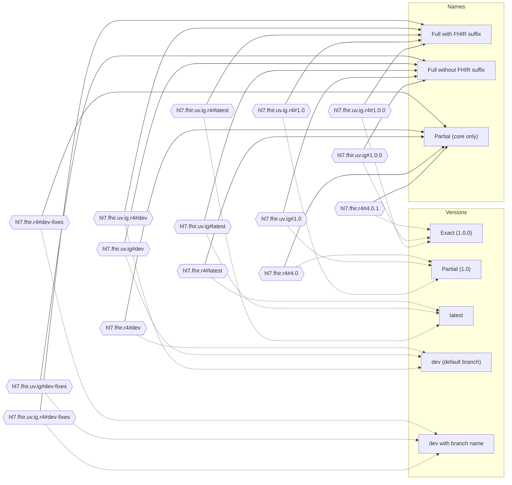

### <a id="n01v01"></a>Name: Full with FHIR suffix + Version: Exact

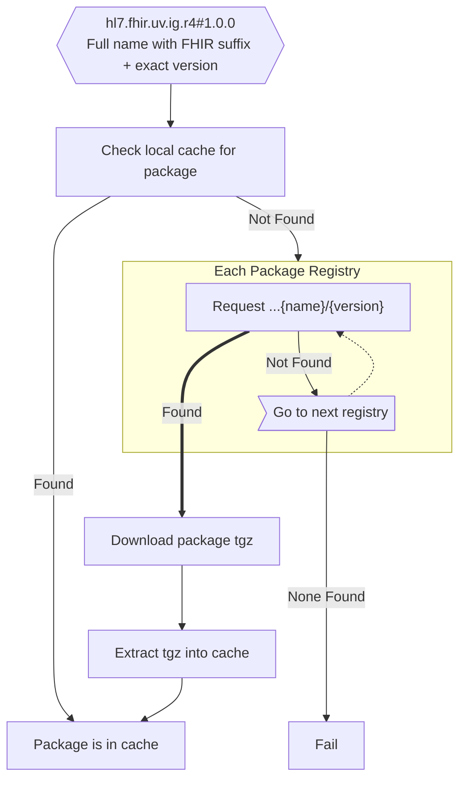

### <a id="n02v01"></a>Name: Full *without* FHIR suffix + Version: Exact

* Note that we are assuming finding a matching package in the cache *and* not having a FHIR-Version-suffixed directory means that resolution completed sucessfully and no FHIR-Version specific package exists.
* Note that we are assuming finding a non-FHIR-suffixed package of the correct version in a registry means that no other registries will have a FHIR-suffixed package.

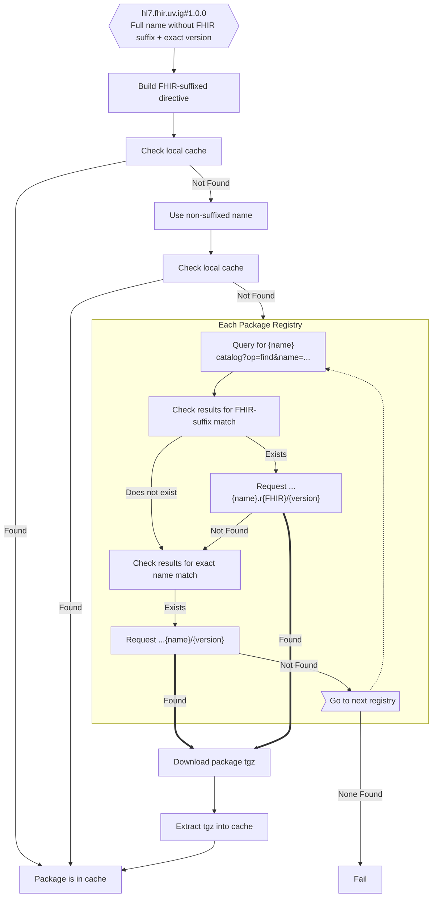

### <a id="n03v01"></a>Name: Partial (core only) + Version: Exact

* Note that users often do not specify the proper names for FHIR core packages - e.g., `hl7.fhir.r4` instead of `hl7.fhir.r4.core`.
* Note that each version of FHIR includes a *different set* of core packages.
  * I default to grabbing *core* and *expansions*, which exist for all non-CI builds since the R4 ballot (CI-Builds do not use explicit version resolution).
  * If you want *examples* those are generally available.  It is hard to describe a rule for when it exists, so it is easier to just try and ignore an error if it does not exist.
  * Other packages need to be specified explicitly (e.g., `hl7.fhir.r5.search`).  While mapping, you could expand out to all packages per version (or search the registry), but I have not seen use cases that require them by default.
  * Fully-explicit package names are resolved as indicated here, but do not require mapping package names and iterating over packages.
* Note that for published core packages, there is an additional fallback to download via the website instead of the registries (necessary when new versions are released and not yet supported/posted).

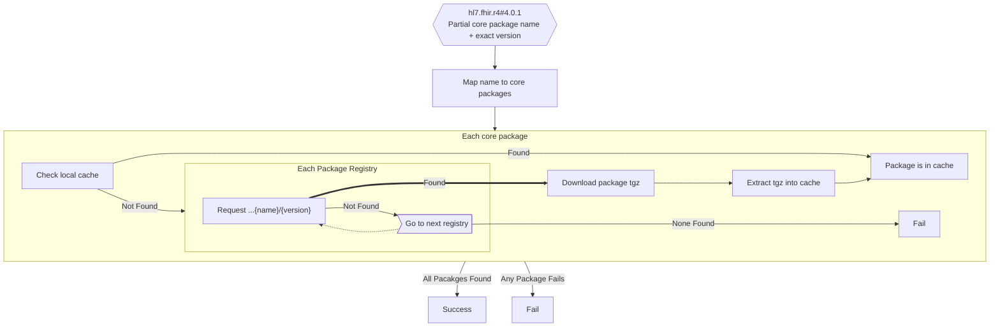


---
### First-pass content below...
---

## Published Version of Core Package

Inputs:
* Fully specified name and specific version: e.g., `hl7.fhir.r4.core#4.0.1` , or
    * Check cache for directive,
    * If not found, jump to Package Retrieval
* Partially specified name and specific version: e.g., `hl7.fhir.r4#4.0.1`, or
    * Map version to version-specific package names - each release version has different packages (all have `core` and `expansions`).
    * Jump to Package Retrieval
* Fully specified name without version: e.g., `hl7.fhir.r4.core`, or
    * Jump to Version Resolution
    * Jump to Package Retrieval
* Partially specified name without version: e.g., `hl7.fhir.r4`, or
    * Map version to version-specific package names - each release version has different packages (all have `core` and `expansions`).
    * Jump to Version Resolution
    * Jump to Package Retrieval
* 'Version name': e.g., `R4`, `DSTU2`.
    * Map version to version-specific package names - each release version has different packages (all have `core` and `expansions`).
    * Jump to Version Resolution
    * Jump to Package Retrieval

Notes:
* Some packages now have FHIR-version specific sub-packages

### Core Version Resolution:

Inputs:
* Complete package name: e.g., `hl7.fhir.r4.core` or `hl7.fhir.r4.expansions`.

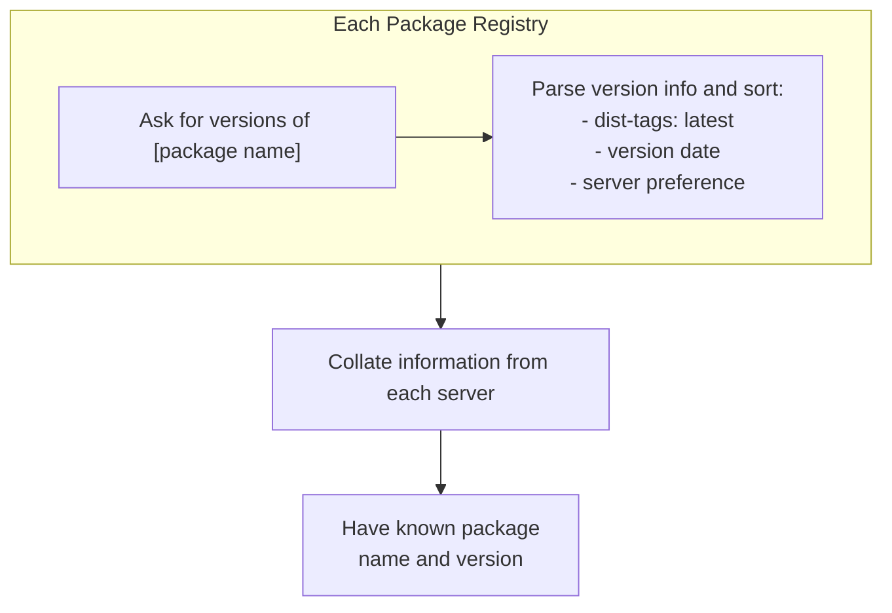

### Core Package Retrieval:

Inputs:
* Complete package name: e.g., `hl7.fhir.r4.core` or `hl7.fhir.r4.expansions`, and
* Specific version: e.g., `4.0.1`.

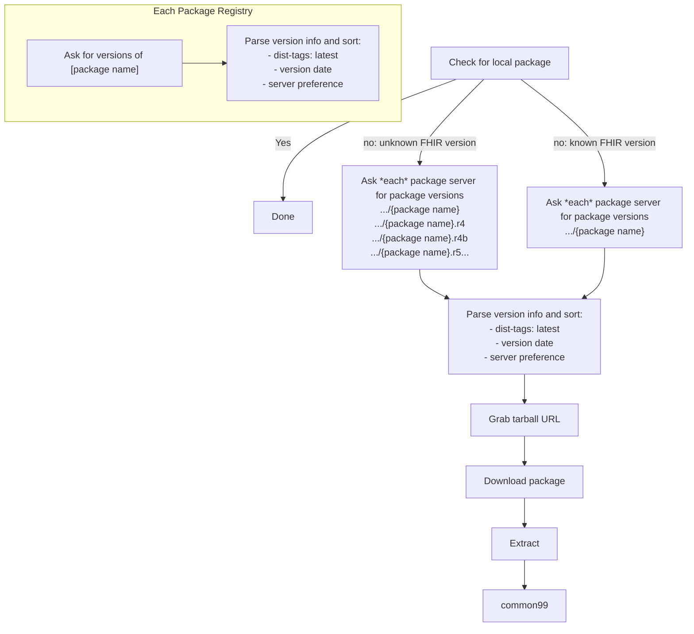

## CI Version of Core Package

Inputs:
* Fully-declared directive: e.g., ``

Notes:
* Cache directive resolves as `#current`, e.g., `hl7.fhir.r6.core#current`.

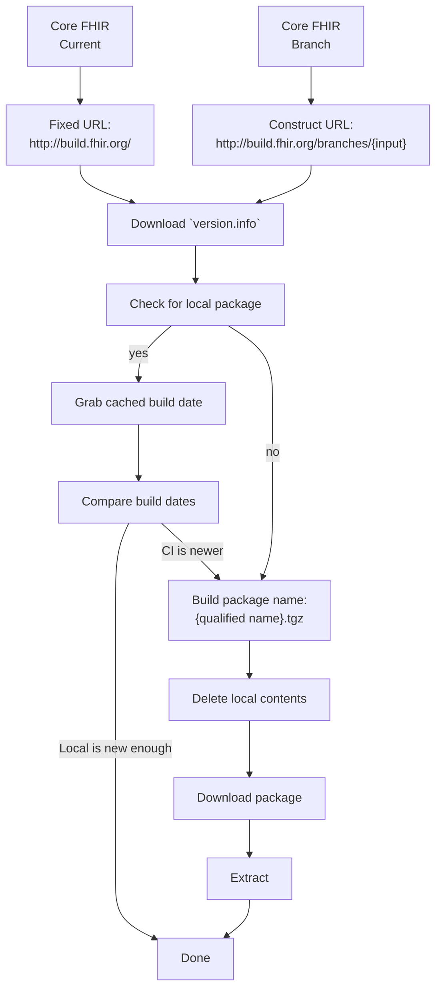


## IG CI Build

Notes:
* I do not know of a method of resolving a package name into a branch name, which means you always have to start with a branch name or URL.
* Main branch cache directive resolves as `#current`, e.g., `hl7.fhir.us.core#current`.
* Named branches resolve as `#current${branchName}`, e.g., `hl7.fhir.us.core#current$FHIR-xxx`

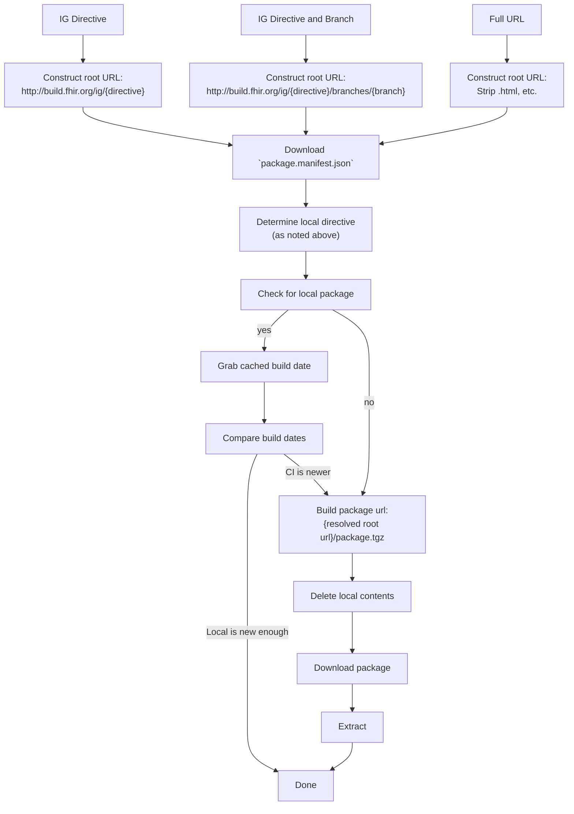

## Published Package With Explicit Version

Notes:
* Some packages now have FHIR-version specific sub-packages

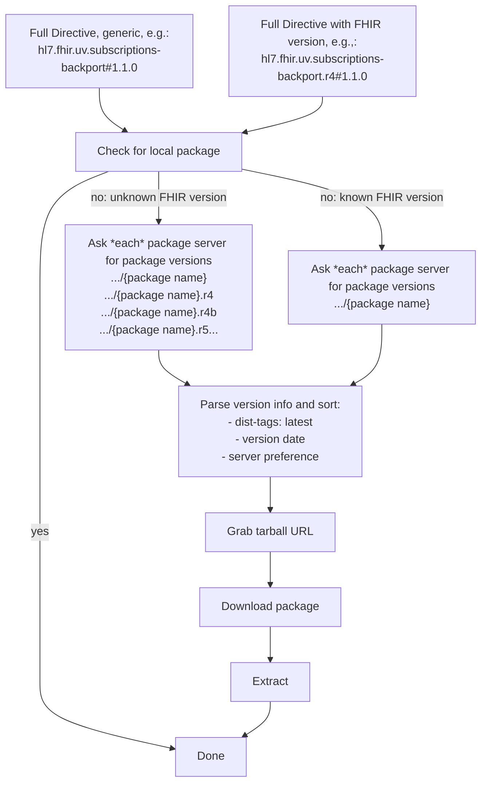


## Published Package Without Explicit Version

Notes:
* Some packages now have FHIR-version specific sub-packages

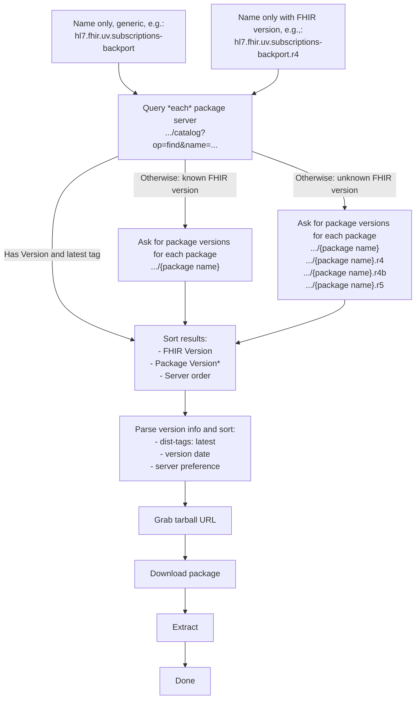
