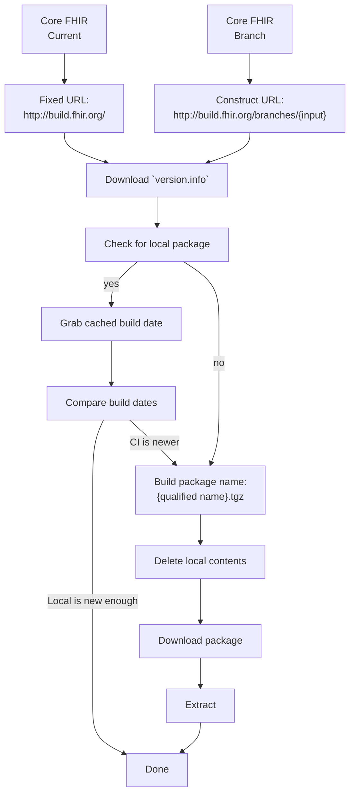
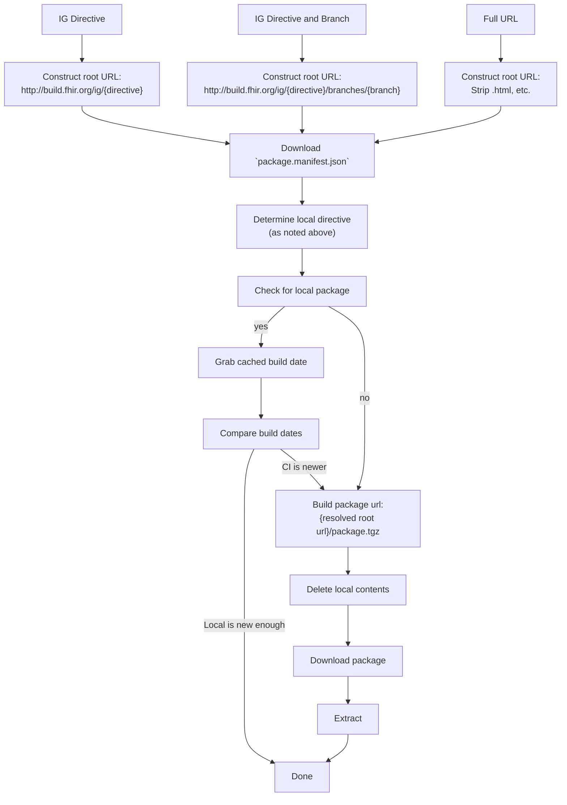
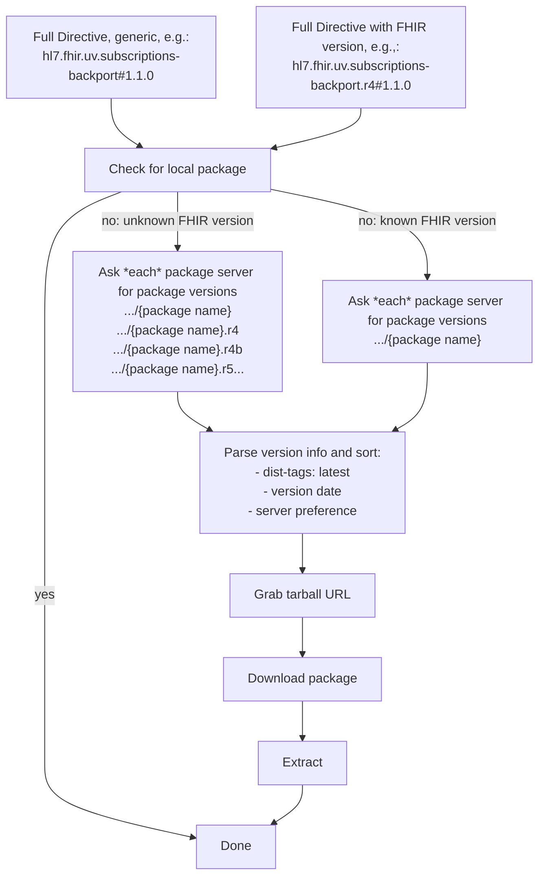
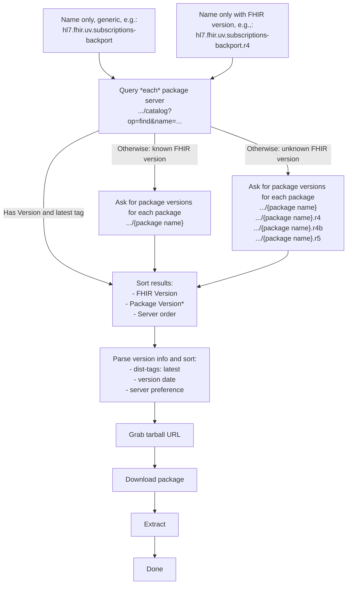

FHIR Package Resolution:

## General Notes

Finding FHIR packages is unfortunately complex.  Below is a set of resolution rules based on various entry points.

## CI Version of Core Package

Notes:
* Cache directive resolves as `#current`, e.g., `hl7.fhir.r6.core#current`.

## IG CI Build

Notes:
* I do not know of a method of resolving a package name into a branch name, which means you always have to start with a branch name or URL.
* Main branch cache directive resolves as `#current`, e.g., `hl7.fhir.us.core#current`.
* Named branches resolve as `#current${branchName}`, e.g., `hl7.fhir.us.core#current$FHIR-xxx`

## Published Package With Explicit Version

Notes:
* Some packages now have FHIR-version specific sub-packages

## Published Package Without Explicit Version

Notes:
* Some packages now have FHIR-version specific sub-packages

